# Hinzufügen eines Formularbereichs zu einer vorhandenen Seite in einem Formular

Diese exemplarische Vorgehensweise zeigt, wie Sie einen angrenzenden Formularbereich der Seite  **Allgemein** des standardmäßigen Kontaktformulars hinzufügen. Die Hauptschritte sind die folgenden:


1. Verwenden Sie den Formular-Designer, um einen angrenzenden Formularbereich zu erstellen, und speichern Sie den Formularbereich in einer OFS-Datei (Outlook Form Storage)  **Contoso.ofs**.
    
2. Verwenden Sie zum Erstellen einer Formularbereich-XML-Manifestdatei für den Formularbereich einen Texteditor wie z. B. Editor. Diese Datei informiert Outlook, wie der Formularbereich (beispielsweise Titel und lokalisierter Aktionsname) angezeigt wird und was seine Aufgabe ist (z. B. benutzerdefinierte Aktionen und Add-In-Unterstützung).
    
3. Verwenden Sie den Windows-Registrierungs-Editor, um den Formularbereich mit einer Nachrichtenklasse zu registrieren, die den Typ der Elemente für Outlook identifiziert, die geeignet sind, diesen Formularbereich zu verwenden.
    
4. Starten Sie Outlook neu, um Sie das aktualisierte Kontaktformular verwenden zu können.
    


Entwerfen des Formularbereichs
Um einen Formularbereich zu erstellen und zu entwerfen, verwenden Sie den Formular-Editor auf die gleiche Weise, wie Sie eine Formularseite anpassen, indem Sie dem Formularbereich Steuerelemente aus der Steuerelement-Toolbox hinzufügen und Steuerelemente optional an Felder binden. Sie erstellen einen angrenzenden Formularbereich, der am Ende der Seite  **Allgemein** des Kontaktformulars angehängt wird. Dieser Formularbereich wird sechs Steuerelemente enthalten. Sie werden die Steuerelemente in den Formularbereich einfügen, drei benutzerdefinierte Felder erstellen und die Steuerelemente an die Felder binden. Wenn Sie den Entwurf abgeschlossen haben, werden Sie den Formularbereich in einer OFS-Datei speichern. Abbildung 1 zeigt die sich ergebende Seite **Allgemein** des Kontaktformulars.

**Abbildung 1. Das benutzerdefinierte Kontaktformular zur Laufzeit - die Seite "Allgemein" enthält unten einen angrenzenden Formularbereich.**


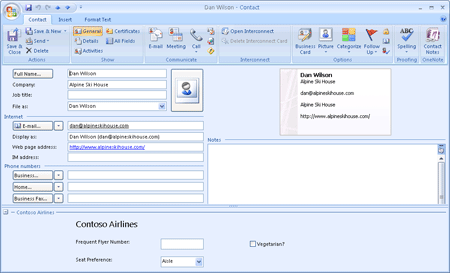

1. Klicken Sie in Outlook auf der Registerkarte "  **Entwicklertools** " im Microsoft Office Fluent-Menüband auf **ein Formular entwerfen**.
    
2. Klicken Sie im Feld  **Formular entwerfen** klicken Sie auf **Kontakt**, und klicken Sie dann auf  **Öffnen**, wie in Abbildung 2.
    
    **Abbildung 2. Wählen Sie Standardformular, um die Anpassung zu starten.**


    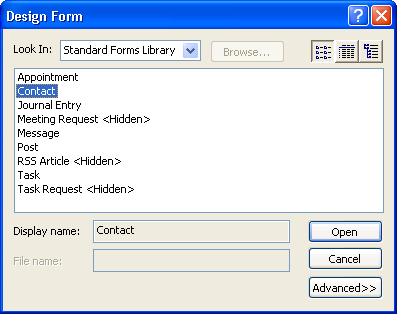

3. Klicken Sie im Formular-Designer auf  **Formularbereich** und dann auf **Neuer Formularbereich**, wie in Abbildung 3.
    
    **Abbildung 3. Erstellen eines Formularbereichs.**


    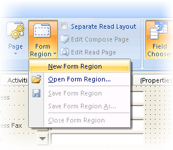

4. Im nächsten Schritt erstellen Sie drei benutzerdefinierte Felder: häufig verwendete Flyer Number, Vegetarian und Arbeitsplatz Option Sie bevorzugen. Wenn die Feldauswahl nicht automatisch angezeigt wurde, klicken Sie auf die  **Feldauswahl** für die Anzeige wie in Abbildung 4.
    
    **Abbildung 4. Verwenden Sie die Feldauswahl zum Erstellen von benutzerdefinierter Feldern.**


    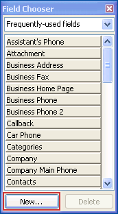

5. Klicken Sie auf  **neu**. Geben Sie als  **Namen** **Häufige Flyer Number** (siehe Abbildung 5), und klicken Sie auf **OK**, um die häufig verwendeten Flyer Number-Feld als ein benutzerdefiniertes Textfeld zu erstellen.
    
    **Abbildung 5. Erstellen Sie das benutzerdefinierte Feld häufige Flyer Number.**


    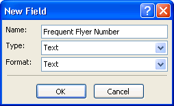

6. Klicken Sie auf  **neu**. Geben Sie als  **Namen** **Vegetarian**, wählen Sie als  **Typ** **Ja/Nein** aus, und wählen Sie **Ja/Nein** als das **Format** (siehe Abbildung 6), und klicken Sie auf **OK**, um die Vegetarian Feld als ein Ja/Nein-Feld zu erstellen.
    
    **Abbildung 6. Erstellen des benutzerdefinierten Felds Vegetarian.**


    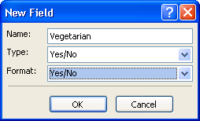

7. Klicken Sie auf  **neu**. Geben Sie  **Arbeitsplatz Präferenz** als **Namen**, wählen Sie  **Text** als **Typ** (siehe Abbildung 7), und klicken Sie auf **OK**, um das Arbeitsplatz Präferenz Feld als ein benutzerdefiniertes Textfeld zu erstellen.
    
    **Abbildung 7. Erstellen des benutzerdefinierten Felds Arbeitsplatz Option Sie bevorzugen.**


    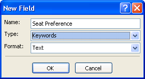

8. Fügen Sie in Schritt 9 bis 12 sechs Outlook-Steuerelemente im Formularbereich.
    
     **Hinweis**  Die Steuerelement-Toolbox wird nur mit Microsoft Forms 2.0-Steuerelementen initialisiert. Wenn Sie ein Forms 2.0-Steuerelement in einen Formularbereich einfügen, ersetzt Outlook automatisch das Forms 2.0-Steuerelement durch das Designgegenstück, wenn ein Outlook-Designgegenstück als Outlook-Steuerelement vorhanden ist. In dieser exemplarischen Vorgehensweise sind die sechs Steuerelemente, die Sie einfügen, ein Kontrollkästchen-Steuerelement, ein Kombinationsfeld-Steuerelement, drei Bezeichnungsfeld-Steuerelemente und ein Textfeld-Steuerelement. Die Forms 2.0-Version dieser Steuerelemente ist standardmäßig in der Toolbox vorhanden. Wen Sie diese Steuerelemente in einen Formularbereich einfügen, zeigt Outlook diese Steuerelemente immer in der Designdarstellung an. Sie müssen der Toolbox die Outlook-Gegenstücksteuerelemente nicht hinzufügen. Dies liegt daran, dass Outlook die Forms 2.0-Steuerelement nach dem Einfügen aus der Toolbox in den Formularbereich durch die Steuerelemente der Outlook-Designgegenparts ersetzt - durch das Microsoft Outlook-Kontrollkästchen-Steuerelement, das Microsoft Outlook-Kombinationsfeld-Steuerelement, das Microsoft OutlookBezeichnungsfeld-Steuerelemente und das Microsoft Outlook-Textfeld-Steuerelement. Andere Microsoft Outlook-Steuerelemente (z. B. das Microsoft Outlook-Empfängersteuerelement und das Microsoft OutlookAbsenderfoto-Steuerelement) sind jedoch nicht standardmäßig in der Toolbox vorhanden. Damit diese Outlook-Steuerelemente erstmals verwendet werden können, müssen Sie sie der Toolbox hinzufügen, indem Sie mit der rechten Maustaste unten in der Toolbox klicken und dann auf  **Benutzerdefinierte Steuerelemente** klicken.

    Abbildung 8 zeigt das resultierende Layout des Formularbereichs, wir möchten erstellen. Schritte 9, 10, 11 und 12 umfassen das Einfügen von Steuerelementen aus der Toolbox, und Binden von benutzerdefinierten Feldern zu einigen der Steuerelemente.
    

    **Abbildung 8. Der gewünschte Formularbereich im Formular-Designer.**


    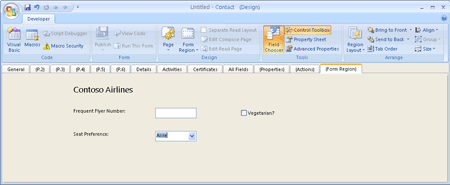

9. Fügen Sie ein Label-Steuerelement für den Titel des Formularbereichs,  **Contoso Airlines** hinzu.
    
      1. Wählen Sie aus, und klicken Sie auf das Label-Steuerelement, um es aus der Toolbox hinzufügen, um den Formularbereich, wie in Abbildung 8 dargestellt.
    
     **Hinweis**  Auswählen-and-Click anstelle von Drag-and-Drop zum Einfügen eines Steuerelements aus der Toolbox in den Formularbereich mit können Sie beim Einfügen des Steuerelements in der entsprechenden Standardgröße im Formularbereich.
  2. Mit der rechten Maustaste in des Label-Steuerelements, klicken Sie auf  **Eigenschaften**. Geben Sie auf der Registerkarte  **Anzeige** **Contoso Airlines** als **Beschriftung** ein.
    
  3. Klicken Sie auf  **Schriftart**, und wählen Sie  **14** unter **Größe**. Klicken Sie auf  **OK**.
    
  4. Klicken Sie auf  **OK**.
    
  5. Verwenden Sie die Maus ziehen der rechte Ziehpunkt des Label-Steuerelement, um die Breite die Länge des Titels zur Erfüllung anzupassen.
    
10. Fügen Sie ein Label-Steuerelement und ein Textfeld-Steuerelement hinzu und Binden von Feld häufige Flyer Number in das Textfeld-Steuerelement.
    
      1. Wählen Sie aus, und klicken Sie auf ein anderes Label-Steuerelement, um es aus der Toolbox hinzufügen, um den Formularbereich, wie in Abbildung 9 dargestellt.
    
  2. Mit der rechten Maustaste in des Label-Steuerelements, klicken Sie auf  **Eigenschaften**. Geben Sie auf der Registerkarte  **Anzeige** **häufig verwendete Flyer Number:** als **Beschriftung**. Klicken Sie auf  **OK**.
    
  3. Verwenden Sie die Maus ziehen der rechte Ziehpunkt des Label-Steuerelement, um die Breite die Länge des Titels zur Erfüllung anzupassen.
    
  4. Wählen Sie aus, und klicken Sie auf das Textfeld-Steuerelement, um es aus der Toolbox hinzufügen, um den Formularbereich, wie in Abbildung 9 dargestellt.
    
  5. Mit der rechten Maustaste in des Textfeld-Steuerelements, klicken Sie auf  **Eigenschaften**. Klicken Sie auf der Registerkarte  **Wert** auf **Feld auswählen**. Zeigen Sie auf  **benutzerdefinierten Felds im Ordner** in der Dropdown-Liste, und klicken Sie auf **Die Gruppe häufig Flyer Number**, wie in Abbildung 9. Klicken Sie dann auf  **OK**.
    
    **Abbildung 9. Binden Sie das Feld für häufige Flyer Number in das Textfeld-Steuerelement.**


    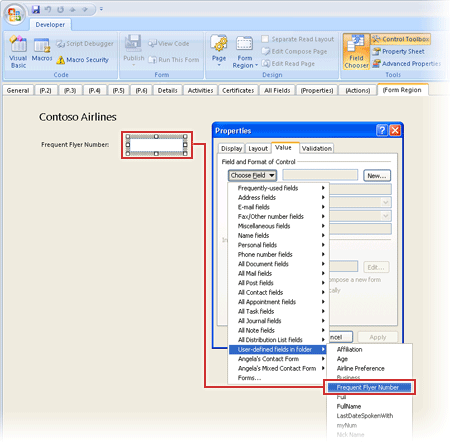

11. Fügen Sie ein Kontrollkästchen-Steuerelement hinzu und binden Sie Feld Vegetarian an das Kontrollkästchen-Steuerelement.
    
      1. Wählen Sie aus, und klicken Sie auf das Kontrollkästchen-Steuerelement, um es aus der Toolbox hinzufügen, um den Formularbereich, wie in Abbildung 10 dargestellt.
    
  2. Mit der rechten Maustaste in des Kontrollkästchen-Steuerelements, klicken Sie auf  **Eigenschaften**. Geben Sie auf der Registerkarte  **Anzeige** **Vegetarian?** als **Beschriftung**, wie in Abbildung 10.
    
    **Abbildung 10. Geben Sie eine Beschriftung für das Kontrollkästchen-Steuerelement.**


    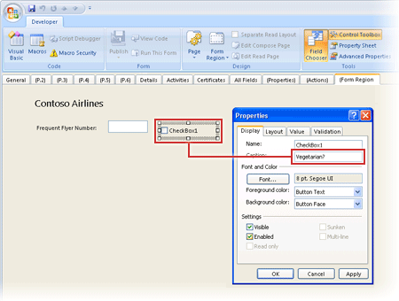

  3. Klicken Sie auf der Registerkarte  **Wert**, klicken Sie auf  **Feld auswählen**. Zeigen Sie auf  **benutzerdefinierten Felds im Ordner** in der Dropdown-Liste, und klicken Sie auf **Vegetarian**, wie in Abbildung 11. Klicken Sie dann auf  **OK**.
    
    **Abbildung 11. Binden von Feld Vegetarian an das Kontrollkästchen-Steuerelement.**


    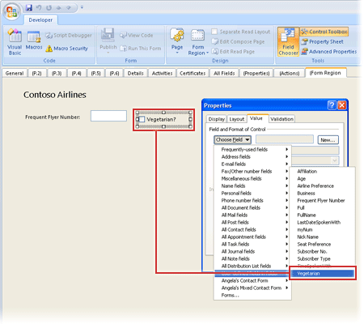

12. Fügen Sie ein Label-Steuerelement und ein Kombinationsfeld-Steuerelement hinzu und binden Sie Feld Arbeitsplatz Präferenz an das Kombinationsfeld-Steuerelement.
    
      1. Wählen Sie aus, und klicken Sie auf das Label-Steuerelement, um es aus der Toolbox hinzufügen, um den Formularbereich, wie in Abbildung 12 dargestellt.
    
  2. Mit der rechten Maustaste in des Label-Steuerelements, klicken Sie auf  **Eigenschaften**. Geben Sie auf der Registerkarte  **Anzeige** **Arbeitsplatz Präferenz:** als **Beschriftung**. Klicken Sie auf  **OK**.
    
  3. Wählen Sie aus, und klicken Sie auf das Kombinationsfeld-Steuerelement, um es aus der Toolbox hinzufügen, um den Formularbereich, wie in Abbildung 12 dargestellt.
    
  4. Mit der rechten Maustaste in des Kombinationsfeld-Steuerelements, klicken Sie auf  **Eigenschaften**. Klicken Sie auf der Registerkarte  **Wert** auf **Feld auswählen**. Zeigen Sie auf  **benutzerdefinierten Felds im Ordner** in der Dropdown-Liste, und klicken Sie auf **Arbeitsplatz Option Sie bevorzugen**, wie in Abbildung 12.
    
    **Abbildung 12. Binden von Feld Arbeitsplatz Präferenz an das Kombinationsfeld-Steuerelement.**


    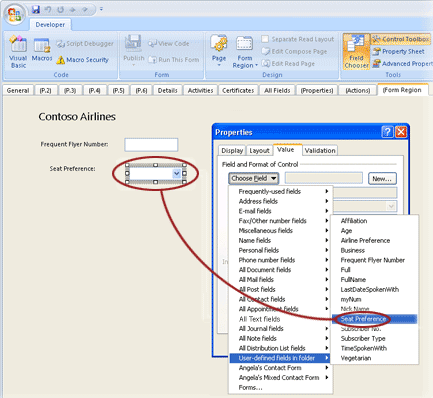

  5. Um Werte für die Dropdown-Liste zu definieren, geben Sie  **Gang, Center, Fenster** als **Mögliche Werte** ein.
    
  6. Überprüfen Sie  **den Anfangswert der dieses Feld, um festzulegen:**, und geben Sie im Textfeld nächsten als anfänglicher Anzeigewert  **Gang** ein. Klicken Sie dann auf **OK**.
    

    
    
13. Steuerelemente für den Formularbereich ausgerichtet.
    
    
    
      1. Halten Sie die UMSCHALTTASTE GEDRÜCKT, und wählen Sie die drei Label-Steuerelemente für  **Contoso Airlines**,  **Häufig verwendeten Flyer Number**, und  **Arbeitsplatz Präferenz:**.
    
  2. Mit der rechten Maustaste, zeigen Sie auf  **Ausrichten**, und wählen Sie  **Linksbündig** aus. Dadurch werden die ausgewählten Steuerelemente an ihre linken Ränder ausgerichtet.
    
  3. Halten Sie die UMSCHALTTASTE GEDRÜCKT, wählen Sie das Textfeld-Steuerelement und das Kombinationsfeld-Steuerelement.
    
  4. Mit der rechten Maustaste, zeigen Sie auf  **Ausrichten**, und wählen Sie  **Linksbündig** aus.
    
  5. Halten Sie die UMSCHALTTASTE GEDRÜCKT, und wählen Sie das Label-Steuerelement für  **Häufig verwendete Flyer Number**, das Textfeld-Steuerelement und das Kontrollkästchen-Steuerelement.
    
  6. Mit der rechten Maustaste, zeigen Sie auf  **Ausrichten**, und wählen Sie  **Unten ausrichten**. Dadurch werden die ausgewählten Steuerelemente an ihre unteren Ränder ausgerichtet.
    
  7. Halten Sie die UMSCHALTTASTE GEDRÜCKT, und wählen Sie das Label-Steuerelement für  **Arbeitsplatz Präferenz:** und das Kombinationsfeld-Steuerelement.
    
  8. Mit der rechten Maustaste, zeigen Sie auf  **Ausrichten**, und wählen Sie  **Unten ausrichten**.
    

    
    
14. Klicken Sie auf  **Formularbereich**, und klicken Sie dann auf  **Formularbereich speichern**. Erstellen Sie einen Ordner  **Formularbereiche** auf dem Laufwerk **C:**, geben Sie **Contoso** als Dateinamen ein, und klicken Sie dann auf **Speichern**.
    
15. Klicken Sie auf  **Nein**, wenn Sie von Outlook gefragt werden  **Möchten Sie die Änderungen speichern?**.
    
Erstellen der Formularbereich-XML-Manifestdatei
Verwendung einer XML-Editor wie Editor zum Erstellen eines Formularbereichs XML-Manifestdatei Contoso.xml in den Ordner c:\Form Regionen. Geben Sie die folgenden Zeilen:


```
<?xml version="1.0"?> 
<FormRegion xmlns="http://schemas.microsoft.com/office/outlook/12/formregion.xsd"> 
    <!-- Internal name --> 
    <name>ContosoAdjoining</name> 
    <!-- Display name --> 
    <title>Contoso Airlines</title> 
    <!--  Additive adjoining form region --> 
    <formRegionType>adjoining</formRegionType> 
    <!--  Outlook form region file is in the current folder relative to the location of contoso.xml --> 
    <layoutFile>Contoso.ofs</layoutFile> 
    <!-- Display form region when inspector is in the Reading Pane --> 
    <showPreview>true</showPreview> 
    <!-- Version of form region --> 
    <version>1.0</version> 
</FormRegion> 

```

Registrieren des Formularbereichs
Damit der Formularbereich ausgeführt werden kann, müssen Sie ihn in der Windows-Registrierung registrieren und dabei die Nachrichtenklasse und andere für Outlook erforderliche Informationen angeben. Sie registrieren diesen Formularbereich, um Kontaktelemente unter dem aktuellen Benutzerschlüssel  **HKEY_CURRENT_USER\Software\Microsoft\Office\Outlook\FormRegions\IPM.Contact** anzuzeigen.


1. Schließen Sie Outlook.
    
2. Fügen Sie den folgenden Schlüssel der Registrierung hinzu, wenn er nicht bereits vorhanden ist:  **HKEY_CURRENT_USER\Software\Microsoft\Office\Outlook\FormRegions**.
    
3. Fügen Sie unter dem Schlüssel  **FormRegions** den Schlüssel **IPM.Contact** hinzu, wenn er nicht bereits vorhanden ist.
    
4. Fügen Sie für den Schlüssel  **IPM.Contact** einen Wert vom Typ **String** hinzu, und geben Sie dabei **ContosoAdjoining** als Namen und **c:\Form Regions\contoso.xml** als Daten an.
    
5. Schließen Sie die Registrierung.
    
Verwenden des Formularbereichs


1. Starten Sie Outlook.
    
2. Öffnen Sie ein Kontaktelement.
    
Der Formularbereich  **Contoso Airlines** wird unten auf der Seite **Allgemein** des Kontaktformulars angezeigt, wie in Abbildung 1 dargestellt.
