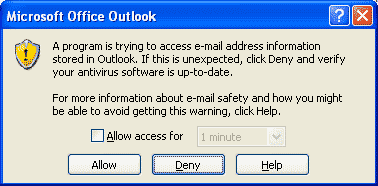
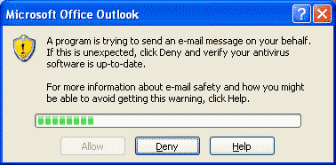
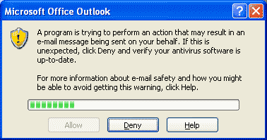

# Sicherheitswarnungen des Outlook-Objektmodells

Abhängig davon, wie Outlook für das Vertrauen in Anwendungen auf einem Clientcomputer konfiguriert wurde, können durch eine Anwendung, in der das Outlook-Objektmodell zum Zugreifen auf bestimmte Daten oder zum Ausführen bestimmter Aktionen verwendet wird, Sicherheitswarnungen ausgelöst werden. Je nach Typ der Information oder Aktion, auf die das Programm zuzugreifen bzw. die das Programm auszuführen versuchte, gibt es drei verschiedene Sicherheitswarnungen, die von Anwendungen über Object Model Guard ausgelöst werden können: die Adressbuchwarnung, die Warnung beim Senden von Nachrichten und die Warnung beim Ausführen von Aktionen. In diesem Thema werden diese Sicherheitswarnungen einzeln beschrieben. Weitere Informationen zum Standardsicherheitsverhalten und den Sicherheitskonfigurationsoptionen von Outlook finden Sie unter [Sicherheitsverhalten des Outlook-Objektmodells](4aa3b7c7-5f3f-41ce-bbf3-75d8ecbd6d4f.md). Weitere Informationen zu den Einstiegspunkten im Objektmodell, durch die Sicherheitswarnungen ausgelöst werden können, finden Sie unter [Geschützte Eigenschaften und Methoden](8522d350-a257-2924-2260-3cc02b6ebbca.md).

## Adressbuchwarnung

Diese Warnung ist die häufigste Sicherheitswarnung, die ausgelöst wird, wenn durch eine nicht vertrauenswürdige Anwendung auf Outlook-Daten zugegriffen wird. Diese Warnung kann durch Einstiegspunkte generiert werden, die unter dem Eingabeaufforderungstyp "Adressbuch" im Thema [Geschützte Eigenschaften und Methoden](8522d350-a257-2924-2260-3cc02b6ebbca.md) identifiziert werden.

Diese Warnung ermöglicht dem Benutzer das Zulassen oder Verweigern der Aktion. Der Benutzer kann auch auswählen, den Zugriff auf das Adressbuch während eines im Dropdownfeld angegebenen Zeitraums zuzulassen.

Wenn der Benutzer auf  **Verweigern** klickt, wird der Aufruf, durch den die Warnung ausgelöst wurde, sofort von Outlook blockiert, und es wird **MAPI_E_NOT_SUPPORTED** zurückgegeben. Für den Aufruf werden von Outlook keine Daten zurückgegeben. Wenn der Fehler vom Programm nicht ordnungsgemäß behandelt wird, stürzt es möglicherweise ab.

Wenn der Benutzer auf  **Zulassen** klickt, ohne das Kontrollkästchen **Zugriff gewähren für** zu aktivieren, wird nur der Aufruf zugelassen, durch den die Warnung generiert wurde. Durch weitere Aufrufe auf der gleichen Zeile oder durch vom blockierten Aufruf abgeleitete Aufrufe von Objekten werden möglicherweise eigene Sicherheitswarnungen generiert.

Wenn der Benutzer auf  **Zulassen** klickt und vorher das Kontrollkästchen **Zugriff gewähren für** aktiviert hat, wird der Aufruf, durch den die Eingabeaufforderung generiert wurde, ebenso wie zukünftige Aufrufe für die vom Benutzer ausgewählte Dauer zugelassen. Während dieses Zeitraums wird für alle Aufrufer des Objektmodells, nicht nur für das Programm, durch das die Sicherheitswarnung ursprünglich ausgelöst wurde, der Zugriff auf das Adressbuch genehmigt. Nach Ablauf dieses Zeitraums werden möglicherweise wieder Sicherheitswarnungen angezeigt.

## Warnung beim Senden von Nachrichten

Diese Warnung wird ausgelöst, wenn durch eine nicht vertrauenswürdige Lösung versucht wird, ein Element programmatisch zu senden. Dieses Dialogfeld enthält einen integrierten Timer, durch den verhindert wird, dass durch nicht vertrauenswürdige Add-Ins schnell und automatisch Nachrichten gesendet werden. Der Benutzer muss fünf Sekunden warten, bevor er auf  **Zulassen** klickt.

Wenn der Benutzer auf  **Verweigern** klickt, wird der Aufruf, durch den die Warnung ausgelöst wurde, von Outlook blockiert, und der Fehler **MAPI_E_NOT_SUPPORTED** wird zurückgegeben. Durch nachfolgende Aufrufe von einer nicht vertrauenswürdigen Lösung zum programmatischen Senden von Nachrichten werden zusätzliche Warnungen generiert.

Wenn der Benutzer auf  **Zulassen** klickt, wird der Aufruf, durch den die Warnung ausgelöst wurde, und zwar nur dieser Aufruf, zugelassen. Durch nachfolgende Aufrufe von einer nicht vertrauenswürdigen Lösung zum programmatischen Senden von Nachrichten werden weiterhin Warnungen generiert.

## Warnung beim Ausführen von Aktionen

Diese Warnung wird ausgelöst, wenn durch eine nicht vertrauenswürdige Lösung eine benutzerdefinierte Aktion aus der  **[Actions](b0903aa4-9b75-5311-d0a5-5ff4a5e29c79.md)** -Auflistung ausgeführt wird. In Outlook wird eine der vorherigen Meldung ähnliche Warnung angezeigt, aus der hervorgeht, dass eine Aktion ausgeführt wird.

Wenn der Benutzer auf  **Verweigern** klickt, wird der Aufruf der **[Execute](29dd0c5c-ed5f-b2cc-45b0-1c8c348239bb.md)** -Methode für diese Aktion von Outlook blockiert und der Fehler **MAPI_E_NOT_SUPPORTED** zurückgegeben.

Wenn der Benutzer auf  **Zulassen** klickt, wird der Aufruf, durch den die Warnung ausgelöst wurde, und zwar nur dieser Aufruf, zugelassen. Durch nachfolgende Aufrufe von einer nicht vertrauenswürdigen Lösung zum Ausführen einer Aktion werden weiterhin Warnungen ausgelöst.

