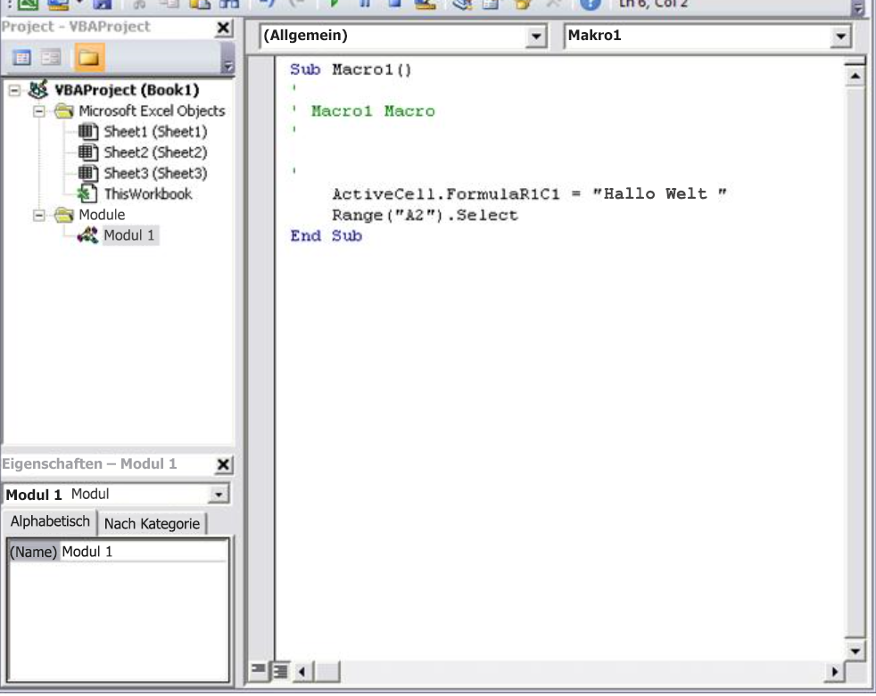
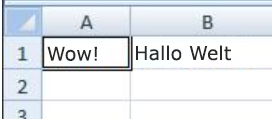
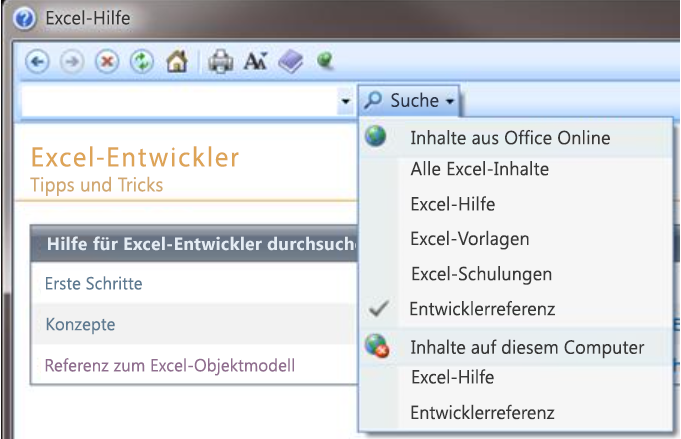

# Erste Schritte mit VBA in Office
In diesem Artikel wird gezeigt, wie Sie mit Visual Basic for Applications (VBA)-Programmierung Office erweitern. 

## VBA-Programmierung in Office
<a name="odc_office14_ta_AddingVBAProgrammingToYourOfficeToolkit_VBAProgrammingInOffice"> </a>

Dieser Artikel richtet sich an erfahrene Office-Benutzer, die sich über VBA informieren und mehr darüber erfahren möchten, wie sie Office durch entsprechende Programmierung anpassen können.

Die Office-Anwendungssuite bietet zahlreiche Funktionen. Es gibt unzählige Möglichkeiten, Dokumente, E-Mails, Datenbanken, Formulare, Kalkulationstabellen und Präsentationen zu erstellen, zu formatieren und zu bearbeiten. Die Stärke der VBA-Programmierung in Office liegt darin, dass Sie fast jeden Vorgang, der sich mit einer Maus, einer Tastatur oder über ein Dialogfeld ausführen lässt, auch mithilfe von VBA ausführen können. Und wenn der Vorgang mit VBA einmal ausgeführt werden kann, lässt er sich auch beliebig oft wiederholen. (Tatsächlich ist die Automatisierung von wiederkehrenden Aufgaben eines der Haupteinsatzgebiete von VBA in Office.)

Doch Sie können das Potenzial der Skripterstellung mit VBA nicht nur zum Beschleunigen von alltäglichen Aufgaben nutzen. Mit VBA können Sie auch neue Funktionen zu Office-Anwendungen hinzufügen oder eine auf Ihre individuellen Geschäftsanforderungen abgestimmte Benutzerführung implementieren, d. h. die Benutzer Ihrer Dokumente an ganz bestimmten Stellen zu Eingaben auffordern oder gezielt mit ihnen interagieren. Beispielsweise können Sie VBA-Code erstellen, um eine Popupmeldung anzuzeigen, die die Benutzer beim ersten Speichern daran erinnert, ein Dokument auf einem bestimmten Netzlaufwerk zu speichern.

In diesem Artikel werden einige der wichtigsten Gründe für den Einsatz der VBA-Programmierung beleuchtet. Außerdem werden die Programmiersprache VBA und die sofort einsatzbereiten Tools vorgestellt, mit denen Sie Ihre Lösungen bearbeiten können. Und schließlich enthält der Artikel einige Tipps und Tricks, um häufige Schwierigkeiten und Fehler bei der Programmierung zu vermeiden.


## VBA-Referenzen für Office-Clients
<a name="odc_office14_ta_AddingVBAProgrammingToYourOfficeToolkit_VBAProgrammingInOffice"> </a>

[Access](http://msdn.microsoft.com/library/0e9c6fa4-3289-4a13-b409-354c70129308%28Office.15%29.aspx)

[Excel](http://msdn.microsoft.com/library/9c1e8386-0309-c52c-856b-963220382eb8%28Office.15%29.aspx)

[Outlook](http://msdn.microsoft.com/library/75e4ad96-62a2-49d2-bc51-48ceab50634c%28Office.15%29.aspx)

[PowerPoint](http://msdn.microsoft.com/library/db64b49a-e02f-4c53-a488-81c017dcea57%28Office.15%29.aspx)

[Project](http://msdn.microsoft.com/library/547d1948-312f-456a-9f7b-8097ec46a436%28Office.15%29.aspx)

[Publisher](http://msdn.microsoft.com/library/f6205a28-3858-4c73-b291-65e56a2fc015%28Office.15%29.aspx)

[Visio](http://msdn.microsoft.com/library/b6834d21-5898-4dd9-af2b-9ffeb1b92a1c%28Office.15%29.aspx)

[Word](http://msdn.microsoft.com/library/3080c270-5198-4b4f-922d-cb13e4b71bb3%28Office.15%29.aspx)

[](http://msdn.microsoft.com/library/9c1e8386-0309-c52c-856b-963220382eb8%28Office.15%29.aspx)


## Einsatzmöglichkeiten und Gründe für VBA
<a name="odc_office14_ta_AddingVBAProgrammingToYourOfficeToolkit_WhenAndWhyToUseVBA"> </a>

Es gibt im Wesentlichen drei Gründe, die VBA-Programmierung in Office einzusetzen.


### Automatisierung und Wiederholung

VBA ist äußerst wirkungsvoll und effizient, wenn es darum geht, wiederholt Formatierungs- oder Korrekturprobleme zu lösen. Einige Beispiele: Haben Sie schon einmal das Absatzformat ganz oben auf jeder Seite in Word geändert? Oder mussten Sie mehrere Tabellen umformatieren, die aus Excel in ein Word-Dokument oder eine E-Mail in Outlook eingefügt worden waren? Oder vielleicht mussten Sie eine Änderung an mehreren Outlook-Kontakten vornehmen?

Wenn Sie eine Änderung häufiger als zehn- oder zwanzigmal vornehmen müssen, lohnt sich unter Umständen die Automatisierung mit VBA. Muss die Änderung sogar mehrere hundert Mal durchgeführt werden, ist die Automatisierung mit Sicherheit den Aufwand wert. Nahezu jede Formatierung oder Bearbeitung, die manuell möglich ist, kann auch mit VBA vorgenommen werden.


### Erweiterungen der Benutzerinteraktion

Manchmal möchten Sie die Benutzer zu einer bestimmten Art der Interaktion mit der Office-Anwendung oder dem Office-Dokument bewegen, die nicht Teil der Standardanwendung ist. Beispielsweise könnten Sie Benutzer beim Öffnen, Speichern oder Drucken eines Dokuments zu einer bestimmten Aktion auffordern.


### Interaktion zwischen Office-Anwendungen

Müssen Sie sämtliche Kontakte aus Outlook in Word kopieren und auf eine bestimmte Weise formatieren? Oder müssen Sie Daten aus Excel auf mehrere PowerPoint-Folien verschieben? Für manche Aufgaben reicht einfaches Kopieren und Einfügen nicht aus oder dauert zu lang. VBA-Programmierung ermöglicht die detaillierte Interaktion mit zwei oder mehr Office-Anwendungen gleichzeitig und das anschließende Ändern des Inhalts in einer Anwendung basierend auf dem Inhalt in einer anderen Anwendung.


### Andere Möglichkeiten

VBA-Programmierung ist eine leistungsstarke Methode, aber nicht immer der optimale Ansatz. In manchen Fällen ist es sinnvoller, andere Methoden einzusetzen, um ans Ziel zu kommen.

Die entscheidende Frage ist, ob es eine einfachere Möglichkeit gibt. Bevor Sie ein VBA-Projekt beginnen, prüfen Sie, ob Sie das Problem mit den integrierten Tools und Standardfunktionen lösen können. Wenn Sie beispielsweise einen zeitaufwändigen Bearbeitungs- oder Layoutvorgang haben, könnten Sie das Problem mithilfe von Formaten oder Zugriffstasten lösen. Können Sie die Aufgabe einmal ausführen und dann mit STRG+Y ( **Wiederholen**) wiederholen? Können Sie ein neues Dokument mit dem richtigen Format oder der richtigen Vorlage erstellen und anschließend den Inhalt in das neue Dokument kopieren? 

Office-Anwendungen sind äußerst leistungsstark. Vielleicht ist bereits die richtige Lösung für Sie vorhanden. Nehmen Sie sich etwas Zeit, und machen Sie sich eingehender mit den Funktionen von Office vertraut, bevor Sie sich an die Programmierung machen.

Bevor Sie ein VBA-Projekt beginnen, sollten Sie die Gewissheit haben, dass Sie genügend Zeit zum Arbeiten mit VBA haben. Programmieren erfordert Konzentration und kann unvorhersehbar sein. Besonders als Anfänger sollten Sie sich nur dann für das Programmieren entscheiden, wenn Sie Zeit haben, um sorgfältig arbeiten zu können. Wenn Sie versuchen, "schnell einmal" ein Skript zu schreiben, um unter Termindruck ein Problem zu lösen, kann dies zu Stress führen. Wenn Sie in Eile sind, nutzen Sie am besten herkömmliche Methoden, auch wenn sie Ihnen monoton vorkommen und eine Aneinanderreihung sich ständig wiederholender Schritte bedeuten.


## VBA-101-Programmierung
<a name="odc_office14_ta_AddingVBAProgrammingToYourOfficeToolkit_VBAProgramming101"> </a>


### Verwenden von Code, damit Anwendungen bestimmte Vorgänge ausführen

Vielleicht haben Sie die Vorstellung, dass das Schreiben von Code ein Buch mit sieben Siegeln ist. Doch die Grundprinzipien fußen auf Alltagslogik und erschließen sich dem Lernenden problemlos. Microsoft Office-Anwendungen wurden wie folgt entwickelt: Sie machen so genannte Objekte verfügbar, die Anweisungen erhalten können, ähnlich wie bei einem Telefon, mit dem Sie über Tasten interagieren. Wenn Sie eine Taste drücken, erkennt das Telefon die Anweisung und schließt die zugehörige Zahl in die Zahlenfolge ein, die Sie wählen. In der Programmierung interagieren Sie mit der Anwendung, indem Sie Anweisungen an verschiedeneObjekte in der Anwendung senden. Diese Objekte sind umfangreich, haben aber ihre Grenzen. Um es salopp auszudrücken: Sie können nur das tun, was sie tun sollen, und sie tun nur das, was Sie ihnen sagen.

Ein Beispiel: Der Benutzer öffnet ein Dokument in Word, nimmt einige Änderungen vor, speichert das Dokument und schließt es. Auf die VBA-Programmierung übertragen bedeutet dies, Word macht ein Document-Objekt verfügbar. Mithilfe von VBA-Code können Sie dem Document-Objekt Anweisungen für Aktionen wie Öffnen, Speichern oder Schließen erteilen.

Im folgenden Abschnitt wird erklärt, wie Objekte organisiert und beschrieben werden.


#### Das Objektmodell

Entwickler organisieren Programmierobjekte in einer Hierarchie, die als das Objektmodell der Anwendung bezeichnet wird. In Word gibt es beispielsweise auf oberster Ebene ein **Application**-Objekt, das ein  **Document**-Objekt enthält. Das  **Document**-Objekt enthält  **Paragraph**-Objekte usw. Objektmodelle spiegeln grob die Darstellung der Benutzeroberfläche wider. Sie sind sozusagen sozusagen eine Konzeptübersicht der Anwendung und ihrer Fähigkeiten.

Die Definition eines Objekts wird als Klasse bezeichnet. Daher werden diese beiden Begriffe manchmal auch als Synonyme verwendet. Technisch gesehen ist eine Klasse die Beschreibung oder Vorlage, mit der ein Objekt erstellt oderinstanziiert wird.

Sobald ein Objekt vorhanden ist, können Sie es verändern, indem Sie seine Eigenschaften festlegen und die zugehörigenMethoden aufrufen. Wenn Sie sich das Objekt einmal als Substantiv vorstellen, sind die Eigenschaften die Adjektive, die das Substantiv beschreiben, und die Methoden sind die Verben, die ausdrücken, was das Substantiv "tut". Wenn Sie eine Eigenschaft ändern, ändert sich ein bestimmtes Merkmal des Erscheinungsbilds oder des Verhaltens des Objekts. Durch Aufrufen einer der Objektmethoden legen Sie fest, dass das Objekt eine bestimmte Aktion ausführt.

Der VBA-Code in diesem Artikel wird in einer geöffneten Office-Anwendung ausgeführt, sodass viele der vom Code manipulierten Objekte bereits laufen (z. B. die Anwendung selbst, das Arbeitsblatt in Excel, das Dokument in Word, die Präsentation in PowerPoint, das Explorer- und das Folder-Objekt in Outlook). Nachdem Sie sich mit dem grundlegenden Aufbau des Objektmodells und den wichtigsten Eigenschaften der Anwendung vertraut gemacht haben, auf denen der aktuelle Status der Anwendung basiert, können Sie damit beginnen, die betreffende Office-Anwendung mithilfe von VBA in Office zu erweitern und zu verändern.


#### Methoden

In Word können Sie beispielsweise die Eigenschaften des aktuellen Word-Dokuments ändern und die Methoden aufrufen, indem Sie die  **ActiveDocument**-Eigenschaft des  **Application**-Objekts verwenden. Diese  **ActiveDocument**-Eigenschaft gibt einen Verweis auf das  **Document**-Objekt zurück, das derzeit in der Word-Anwendung aktiv ist. "Einen Verweis zurückgeben auf" bedeutet "Zugriff ermöglichen auf".

Der folgende Code zeigt genau, was er tut: Er speichert das aktive Dokument in der Anwendung.


```VB.net
Application.ActiveDocument.Save
```

Von links nach rechts bedeutet der Code: "In dieser Anwendung (Application) wird mit dem Dokument, auf das mit ActiveDocument verwiesen wird, die  **Save**-Methode aufgerufen." Beachten Sie, dass Save die einfachste Form einer Methode ist. Sie erfordert keine ausführlichen Anweisungen von Ihnen. Sie erteilen einem  **Document**-Objekt die  **Save**-Anweisung; darüber hinaus sind keine weiteren Eingaben von Ihnen erforderlich. 

Wenn eine Methode weitere Informationen erfordert, werden diese als Parameter bezeichnet. Der folgende Code führt die **SaveAs**-Methode aus, für die ein neuer Name für die Datei erforderlich ist.


```VB.net
Application.ActiveDocument.SaveAs ("New Document Name.docx")
```

Die Werte, die nach dem Methodennamen in Klammern angegeben werden, sind die Parameter. Hier ist der neue Name für die Datei ein Parameter für die  **SaveAs**-Methode.


#### Eigenschaften

Zum Festlegen einer Eigenschaft wird dieselbe Syntax wie zum Lesen einer Eigenschaft verwendet. Der folgende Code führt eine Methode aus, um Zelle A1 in Excel zu markieren und eine Eigenschaft festzulegen, mit der etwas in diese Zelle eingefügt wird.


```VB.net
    Application.ActiveSheet.Range("A1").Select
    Application.Selection.Value = "Hello World"
```

Die erste Herausforderung bei der VBA-Programmierung besteht darin, ein Gefühl für das Objektmodell jeder Office-Anwendung zu bekommen und die Objekt-, Methoden- und Eigenschaftensyntax zu verstehen. Die Objektmodelle sind in allen Office-Anwendungen ähnlich, beziehen sich aber jeweils auf die Dokument- und Objektarten, die verändert werden.

In der ersten Zeile des Codeausschnitts befindet sich das  **Application**-Objekt, in diesem Fall Excel, und  **ActiveSheet**, das Zugriff auf das aktive Arbeitsblatt bietet. Dahinter befindet sich ein weniger geläufiger Begriff, Range, der einen Zellenbereich definiert. Der Code weist  **Range** an, sich selbst zu erstellen, wobei nur A1 als Zelle definiert ist. In anderen Worten wird in der ersten Codezeile ein Objekt (der Bereich) definiert und eine Methode ausgewählt, um den Bereich zu markieren. Das Ergebnis wird automatisch in einer anderen Eigenschaft von **Application** namens **Selection** gespeichert.

In der zweiten Codezeile wird die  **Value**-Eigenschaft von  **Selection** auf den Text "Hello World" festgelegt. Der Wert wird in der Zelle A1 angezeigt.

Der einfachste VBA-Code greift einfach nur auf Objekte in der Office-Anwendung zu, mit der Sie arbeiten und legt Eigenschaften fest. Beispielsweise können Sie Zugriff auf die Zeilen in einer Tabelle in Word erhalten und die Formatierung im VBA-Skript ändern. 

Das hört sich einfach an, kann aber unglaublich hilfreich sein. Sobald Sie diesen Code schreiben können,steht Ihnen die gesamte Leistungsfähigkeit der Programmierung zur Verfügung, um dieselben Änderungen in mehreren Tabellen oder Dokumenten bzw. nach einer bestimmten Logik oder Bedingung vorzunehmen. Für einen Computer ist es egal, ob er 1.000 Änderungen durchführt oder 10. Es gibt also bei größeren Dokumenten oder schwierigeren Problemstellungen ein enormes Einsparpotenzial, da Sie mit VBA sehr viel Zeit sparen können.


### Makros und der Visual Basic-Editor

Sie haben nun eine Vorstellung davon, wie in Office-Anwendungen Objektmodelle verfügbar gemacht werden. Wahrscheinlich möchten Sie auch gleich ausprobieren, wie Sie mit dem Aufrufen von Objektmethoden, Festlegen von Objekteigenschaften und Antworten auf Objektereignisse zurechtkommen. Dazu müssen Sie Code an einer Stelle und mit einer Vorgehensweise schreiben, die von Office „verstanden" wird - das ist in der Regel der Visual Basic-Editor. Dieser Editor ist zwar standardmäßig installiert, vielen Benutzern aber gänzlich unbekannt, bevor er nicht auf dem Menüband aktiviert ist.


#### Öffnen der Registerkarte "Entwickler"

In allen Office-Anwendungen wird das Menüband verwendet. Eine der Registerkarten auf dem Menüband ist die Registerkarte  **Entwickler**, über die Sie den Visual Basic-Editor und andere Tools für Entwickler aufrufen können. Da die Registerkarte  **Entwickler** in Office nicht standardmäßig angezeigt wird, müssen Sie sie wie folgt aktivieren:


### So aktivieren Sie die Registerkarte Entwickler


1. Klicken Sie auf der Registerkarte  **Datei** auf **Optionen**, um das Dialogfeld  **Optionen** zu öffnen.
    
2. Klicken Sie auf der linken Seite des Dialogfelds auf  **Menüband anpassen**.
    
3. Wählen Sie auf der linken Seite des Dialogfelds unter  **Befehle auswählen** den Eintrag **Häufig verwendete Befehle** aus.
    
4. Klicken Sie auf der rechten Seite des Dialogfelds unter  **Menüband anpassen** im Dropdown-Listenfeld auf **Hauptregisterkarten**, und aktivieren Sie dann das Kontrollkästchen  **Entwickler**.
    
5. Klicken Sie auf  **OK**.
    

 **Hinweis**  In Office 2007 konnten Sie die Registerkarte  **Entwickler** anzeigen, indem Sie auf die Office-Schaltfläche und dann auf **Optionen** klickten und anschließend im Dialogfeld **Optionen** in der Kategorie **Häufig verwendet** das Kontrollkästchen **Registerkarte 'Entwicklertools' im Menüband anzeigen** aktivierten.

Nachdem Sie die Registerkarte  **Entwickler** aktiviert haben, finden Sie die Schaltflächen für **Visual Basic** und **Makros** auf den ersten Blick.


**Abbildung 1: Schaltflächen auf der Registerkarte 'Entwicklertools'**


#### Überlegungen zur Sicherheit

Zum Schutz von Office-Benutzern vor Viren und gefährlichen Makrocode ist es nicht möglich, Makrocode in einem normalen Office-Dokument mit einer normalen Dateierweiterung zu speichern. Stattdessen müssen Sie den Code in einer Datei mit einer Spezialerweiterung speichern. Beispielsweise können Sie Makros nicht in einem normalen Word-Dokument mit der Erweiterung DOCX speichern, sondern müssen ein spezielles Word-Dokument mit Makros (Erweiterung DOCM) verwenden.

Beim Öffnen einer DOCM-Datei verhindert die Office-Sicherheit u. U. dennoch die Ausführung der Makros im Dokument, möglicherweise, ohne eine entsprechende Meldung auszugeben. Überprüfen Sie die Einstellungen und Optionen im Sicherheitscenter für alle Office-Anwendungen. Gemäß Standardeinstellung ist die Makroausführung deaktiviert, Sie erhalten aber eine Warnung, dass Makros deaktiviert wurden, und haben die Möglichkeit, die Makros für das jeweilige Dokument zu aktivieren. 

Sie können bestimmte Ordner angeben, in denen Makros ausgeführt werden können, indem Sie vertrauenswürdige Speicherorte, vertrauenswürdige Dokumente oder vertrauenswürdige Herausgeber erstellen. Am vielseitigsten sind vertrauenswürdige Herausgeber; dabei werden die von Ihnen verteilten Dokumente digital signiert. Weitere Informationen zu den Sicherheitseinstellungen in einer bestimmten Office-Anwendung erhalten Sie, wenn Sie im Dialogfeld  **Optionen** auf **Trust Center** und dann auf **Einstellungen für das Trust Center** klicken.


 **Hinweis**  In einigen Office-Anwendungen wie Outlook werden Makros standardmäßig in einer Mastervorlage auf dem lokalen Computer gespeichert. Diese Strategie vermindert zwar lokale Sicherheitsprobleme auf dem eigenen Computer beim Ausführen eigener Makros, macht allerdings eine Bereitstellungsstrategie zur Verteilung des Makros erforderlich.


#### Aufzeichnen eines Makros

Wenn Sie auf der Registerkarte  **Entwickler** auf die Schaltfläche **Makro** klicken, wird das Dialogfeld **Makros** geöffnet, in dem Sie auf VBA-Unterroutinen oder -Makros in einem bestimmten Dokument oder einer bestimmten Anwendung zugreifen können. Über die Schaltfläche **Visual Basic** öffnen Sie den Visual Basic-Editor, in dem Sie VBA-Code erstellen und bearbeiten.

Eine weitere Schaltfläche auf der Registerkarte  **Entwickler** in Word und Excel ist **Makro aufzeichnen**, die automatisch VBA-Code generiert, der Ihre in der Anwendung durchgeführten Aktionen reproduziert.  **Makro aufzeichnen** ist ein hervorragendes Tool, um sich intensiver mit VBA auseinanderzusetzen. Durch Lesen des generierten Codes erhalten Sie einen Einblick in VBA und können Ihr Wissen über Office als Anwender und Ihre Programmierkenntnisse optimal miteinander verknüpfen. Der einzige Vorbehalt ist, dass der generierte Code verwirrend sein kann, weil der Makro-Editor Ihre Absichten nicht kennt und daher Annahmen treffen muss, die möglicherweise nicht richtig sind.


### So zeichnen Sie ein Makro auf


1. Öffnen Sie in Excel eine neue Arbeitsmappe, und klicken Sie auf dem Menüband auf die Registerkarte  **Entwickler**. Klicken Sie auf  **Makro aufzeichnen**, und akzeptieren Sie alle Standardeinstellungen im Dialogfeld  **Makro aufzeichnen**, auch Makro1 als Name für das Makro undDiese Arbeitsmappe als Speicherort.
    
2. Klicken Sie auf  **OK**, um die Aufzeichnung des Makros zu starten. Der Text der Schaltfläche ändert sich in  **Aufzeichnung beenden**. Klicken Sie auf die Schaltfläche, sobald Sie alle Aktionen abgeschlossen haben, die Sie aufzeichnen möchten.
    
3. Klicken Sie in Zelle B1, und geben Sie die typische erste Zeichenfolge jedes Programmierers ein: Hello World. Beenden Sie die Eingabe, und sehen Sie sich die Schaltfläche  **Aufzeichnung beenden** an: Sie ist ausgegraut, weil Excel wartet, bis Sie die Eingabe in der Zelle beenden.
    
4. Klicken Sie in Zelle B2, um die Aktion in Zelle B1 abzuschließen, und klicken Sie dann auf  **Aufzeichnung beenden**.
    
5. Klicken Sie auf der Registerkarte  **Entwickler** auf **Makros**, wählen Sie ggf.  **Makro1** aus, und klicken Sie dann auf **Bearbeiten**, um den Code von Makro1 im Visual Basic-Editor anzuzeigen.
    

**Abbildung 2: Makrocode im Visual Basic-Editor**




#### Der Code im Einzelnen

Das von Ihnen erstellte Makro sollte dem folgenden Code ähneln.


```VB.net
Sub Macro1()
'
' Macro1 Macro
'
'
    Range("B1").Select
    ActiveCell.FormulaR1C1 = "Hello World"
    Range("B2").Select
End Sub
```

Achten Sie auf die Ähnlichkeiten und auch die Unterschiede gegenüber dem vorherigen Codeausschnitt zum Auswählen von Text in Zelle A1. In diesem Code wird Zelle B1 ausgewählt und dann die Zeichenfolge "Hello World" in die so aktivierte Zelle übernommen. Die Anführungszeichen um den Text kennzeichnen einen Zeichenfolgenwert gegenüber einem numerischen Wert. 

Erinnern Sie sich noch, dass Sie in Zelle B2 geklickt hatten, um die Schaltfläche  **Aufzeichnung beenden** wieder anzuzeigen? Diese Aktion ist hier ebenfalls als Codezeile sichtbar. Die Makroaufzeichnung erfasst jeden Tastendruck.

Die Codezeilen, die mit einem Apostroph beginnen und im Editor grün dargestellt werden, sind Kommentare, die entweder den Code genauer erklären oder Sie und andere Programmierer an den Zweck des Codes erinnern. In VBA wird jede Zeile bzw. jeder Teil einer Zeile ignoriert, die bzw. der mit einem einfachen Anführungszeichen beginnt. Das klare und sinnvolle Kommentieren des Codes ist ein wichtiges Thema, das aber den Umfang dieses Artikels sprengen würde. Wenn weiter hinten in diesem Artikel auf diesen Code verwiesen wird, sind diese vier Kommentarzeilen nicht mehr enthalten.

Zum Generieren des Codes werden anhand eines komplexen Algorithmus die beabsichtigten Methoden und Eigenschaften ermittelt. Falls Sie eine Eigenschaft nicht erkennen können, gibt es unzählige hilfreiche Ressourcen. Beispielsweise verweist der von der Makroaufzeichnung generierte Code Ihres Makros auf die  **ForumulaR1C1**-Eigenschaft. Sie wissen nicht, was das zu bedeuten hat?


 **Tipp**  Hinweis: Das  **Application**-Objekt muss in allen VBA-Makros impliziert werden. Jede Zeile des von Ihnen aufgezeichneten Codes beginnt mit  **Application.**.


#### Verwenden der Entwicklerhilfe

Wählen Sie im aufgezeichneten Makro  **ForumulaR1C1** aus, und drücken Sie F1. Das Hilfesystem wird daraufhin durchsucht, bis die entsprechenden Themen im Abschnitt für Excel-Entwickler der Excel-Hilfe gefunden wurden. Dann wird die **FormulaR1C1**-Eigenschaft angezeigt. Über den Link können Sie weitere Informationen zu der Eigenschaft aufrufen. Achten Sie jedoch zunächst auf den Link  **Excel-Objektmodellreferenz** im unteren Fensterbereich. Klicken Sie auf den Link, um eine lange Liste von Objekten anzuzeigen, die im Objektmodell von Excel zur Beschreibung von Arbeitsblättern und deren Komponenten verwendet werden. Klicken Sie auf eines dieser Objekte, um die entsprechenden Eigenschaften und Methoden sowie Querverweise auf andere, verwandte Optionen anzuzeigen. Zahlreiche Hilfeeinträge enthalten auch kurze Codebeispiele zur Erklärung. Folgen Sie beispielsweise den Links im **Borders**-Objekt, um zu erfahren, wie Sie in VBA einen Rand festlegen.


```VB.net
Worksheets(1).Range("A1").Borders.LineStyle = xlDouble
```


#### Bearbeiten von Code

Der  **Borders**-Code sieht anders aus als das aufgezeichnete Makro. Eines kann bei einem Objektmodell etwas verwirrend sein, nämlich die Tatsache, dass es mehrere Möglichkeiten gibt, ein Objekt (in diesem Beispiel die Zelle A1) zu adressieren. 

Eine der besten Möglichkeiten, das Programmieren zu erlernen, ist manchmal, kleinere Änderungen an funktionierendem Code vorzunehmen und zu sehen, was passiert. Versuchen Sie es. Öffnen Sie Makro1 im Visual Basic-Editor, und ändern Sie den Code wie folgt.


```VB.net
Sub Macro1()
    Worksheets(1).Range("A1").Value = "Wow!"
    Worksheets(1).Range("A1").Borders.LineStyle = xlDouble
End Sub
```


 **Tipp**  Verwenden Sie beim Arbeiten mit Code wo möglich Kopieren und Einfügen, um Eingabefehler zu vermeiden. 

Sie müssen den Code nicht speichern, um ihn testen zu können. Kehren Sie jetzt zum Excel-Dokument zurück, indem Sie auf der Registerkarte  **Entwickler** auf **Makros**, dann auf  **Makro1** und anschließend auf **Ausführen** klicken. Die Zelle A1 enthält jetzt den TextWow! und ist von einem doppellinigen Rahmen umgeben.


**Abbildung 3: Ergebnisse Ihres ersten Makros**



Sie haben durch eine Kombination aus einer Makroaufzeichnung, dem Lesen der Objektmodelldokumentation und einfacher Programmierung ein funktionierendes VBA-Programm erstellt. Herzlichen Glückwunsch!

Es hat nicht funktioniert? Lesen Sie weiter, um Vorschläge für das Debuggen in VBA zu erhalten.


## Tipps und Tricks für die Programmierung
<a name="odc_office14_ta_AddingVBAProgrammingToYourOfficeToolkit_ProgrammingTipsAndTricks"> </a>


### Mit Beispielen anfangen

Es gibt unzählige VBA-Programmierer. Bei einer Websuche finden Sie fast immer ein Beispiel für VBA-Code mit einer ähnlichen Funktion, wie Sie benötigen. Wenn Sie kein gutes Beispiel finden, können Sie die Aufgabe in kleinere Komponenten unterteilen und nach diesen suchen. Oder Sie können sich eine ähnliche, aber gängigere Problemstellung überlegen. Wenn Sie mit einem Beispiel beginnen, können Sie sich viele Stunden Arbeit sparen.

Das bedeutet aber nicht, dass im Web kostenloser und sorgfältig durchdachter Code nur auf Sie wartet. Es kann durchaus sein, dass der gefundene Code Fehler enthält. Die Beispiele, die Sie online oder in der VBA-Dokumentation finden, sollen Ihnen lediglich den Einstieg erleichtern. Vergessen Sie nicht: Das Erlernen der Programmierung kostet Zeit und Überlegung. Bevor Sie in letzter Minute eine andere Lösung für Ihr Problem finden müssen, sollten Sie sich lieber von Anfang an fragen, ob VBA die richtige Wahl für die Aufgabenstellung ist.


### Das Problem vereinfachen

Die Programmierung wird schnell äußerst kompliziert. Gerade für Anfänger ist es daher wichtig, das Problem in möglichst kleine logische Einheiten zu untergliedern und die einzelnen Teile isoliert zu schreiben und zu testen. Wenn Sie angesichts des Codes vor Ihnen den Überblick verlieren, sollten Sie die Arbeit unterbrechen und an etwas anderes denken. Wenn Sie danach wieder zu Ihrer Aufgabenstellung zurückkehren, kopieren Sie einen kleinen Teil des Problems in ein neues Modul, lösen Sie diesen Teil, erstellen Sie funktionsfähigen Code, und testen Sie diesen. Machen Sie dann mit dem nächsten Teil weiter. 


### Fehler und Debuggen

Es gibt im Wesentlichen zwei Arten von Programmierfehlern: Syntaxfehler, die gegen Grammatikregeln der Programmiersprache verstoßen, und Laufzeitfehler, die zwar syntaktisch korrekt sind, aber beim Ausführen des Codes einen Fehler verursachen.

Syntaxfehler sind zwar manchmal schwierig zu beheben, dafür aber umso leichter zu finden. Im Visual Basic-Editor werden Sie akustisch und visuell auf Syntaxfehler im Code aufmerksam gemacht.

Beispielsweise müssen Zeichenfolgenwerte in VBA zwischen doppelten Anführungszeichen stehen. Probieren Sie selbst aus, was passiert, wenn Sie stattdessen einfache Anführungszeichen verwenden. Kehren Sie zum Visual Basic-Editor zurück, und ersetzen Sie die Zeichenfolge "Wow!" im Codebeispiel durch 'Wow!' (das Wort Wow in einfachen Anführungszeichen). Sobald Sie in die nächste Zeile klicken, reagiert der Visual Basic-Editor. Die Fehlermeldung "Kompilierungsfehler: Erwartet: Ausdruck" allein ist nicht besonders hilfreich, deshalb wird zusätzlich die fehlerhafte Zeile rot dargestellt, um Sie darauf aufmerksam zu machen, dass die Zeile einen Syntaxfehler enthält und das Programm daher nicht ausgeführt werden kann.

Klicken Sie auf  **OK**, und ändern Sie den Text wieder in "Wow!".

Laufzeitfehler sind schwieriger zu finden, weil die Programmiersyntax an sich korrekt aussieht, der Code aber beim Versuch, ihn auszuführen, einen Fehler verursacht.

Ein Beispiel: Öffnen Sie den Visual Basic-Editor, und ändern Sie den Namen der  **Value**-Eigenschaft in Ihrem Makro in ValueX. Auf diese Weise verursachen Sie bewusst einen Laufzeitfehler, da das  **Range**-Objekt keine Eigenschaft namens ValueX besitzt. Kehren Sie zum Excel-Dokument zurück, öffnen Sie das Dialogfeld  **Makros**, und führen Sie Makro1 erneut aus. Nun sollte eine Visual Basic-Meldung angezeigt werden, in der Sie darauf aufmerksam gemacht werden, dass das Objekt diese Eigenschaft oder Methode nicht unterstützt und ein Laufzeitfehler vorliegt. Diese Fehlermeldung ist zwar eindeutig, klicken Sie aber dennoch auf „Debuggen", um mehr zu erfahren.

Wenn Sie zum Visual Basic-Editor zurückkehren, befindet sich dieser in einem speziellen Debugmodus, in dem die fehlerhafte Codezeile gelb markiert ist. Erwartungsgemäß ist die Zeile mit der  **ValueX**-Eigenschaft hervorgehoben.


**Abbildung 4: Visual Basic-Debugger wird ausgeführt**


Sie können den VBA-Code während der Ausführung bearbeiten. Ändern Sie daher ValueX wieder zurück in **Value**, und klicken Sie auf die kleine grüne Wiedergabeschaltfläche unter dem Menü  **Debuggen**. Das Programm sollte jetzt wieder normal ausgeführt werden.

Es empfiehlt sich, sich mit der Verwendung des Debuggers für längere und komplexere Programme vertraut zu machen. Sie sollten zumindest wissen, wie Sie Haltepunkte setzen, um die Ausführung an einem Punkt zu beenden und sich den Code näher anzusehen, wie Sie Überwachungen hinzufügen, um die Werte verschiedener Variablen und Eigenschaften während der Codeausführung zu sehen, und wie Sie den Code Zeile für Zeile durchgehen. Alle diese Optionen sind im Menü  **Debuggen** verfügbar. Wenn Sie sich ernsthaft mit dem Debugger auseinandersetzen, werden Sie bald auch die entsprechenden Tastenkombinationen auswendig wissen.


### Referenzmaterial sinnvoll nutzen

Zum Öffnen der Entwicklerreferenz, die in die Office-Hilfe integriert ist, öffnen Sie die Hilfereferenz in einer beliebigen Office-Anwendung, indem Sie auf dem Menüband auf das Fragezeichen klicken oder die Taste F1 drücken. Klicken Sie dann rechts neben der Schaltfläche  **Suchen** auf den Dropdownpfeil, um die Inhalte zu filtern. Klicken Sie auf **Entwicklerreferenz**. Wenn im linken Fensterbereich kein Inhaltsverzeichnis angezeigt wird, klicken Sie auf das kleine Buchsymbol, um das Inhaltsverzeichnis zu öffnen, und erweitern Sie anschließend die Objektmodellreferenz.


**Abbildung 5. Das Filtern der Entwicklerhilfe gilt für alle Office-Anwendungen**



Der Zeitaufwand für die Auseinandersetzung mit der Objektmodellreferenz zahlt sich aus. Wenn Sie die Grundlagen der VBA-Syntax und das Objektmodell für die verwendete Office-Anwendung verstanden haben, können Sie systematisch programmieren.

Selbstverständlich ist das [Microsoft Office Developer Center](http://msdn.microsoft.com/de-de/office/default.aspx) ein exzellentes Portal für Artikel, Tipps und Informationen für die Entwicklercommunity.


### In Foren und Gruppen suchen

Alle Programmierer kommen irgendwann trotz der Lektüre sämtlicher Referenzartikel und schlafloser Nächte, in denen sie die verschiedenen Möglichkeiten zur Lösung ihres Problems durchgehen, einfach nicht mehr weiter. Glücklicherweise gibt es im Internet eine Entwicklercommunity, deren Mitglieder sich gegenseitig bei Programmierproblemen helfen.

Suchen Sie einfach im Internet nach "office entwickler forum", um mehrere Diskussionsgruppen zu finden. Suchen Sie nach "office entwicklung" oder nach einer Beschreibung Ihres Problems, um auch Foren, Blogbeiträge und Artikel zu finden.

Wenn Sie selbst nicht mehr weiterwissen, zögern Sie nicht, Ihre Frage in einem Entwicklerforum zu veröffentlichen. Diese Foren akzeptieren auch Beiträge unerfahrener Entwickler, und viele erfahrene Programmierer helfen sehr gern.

Beachten Sie bei der Veröffentlichung eines Beitrags in einem Entwicklerforum die folgenden Benimmregeln:


- Suchen Sie vor der Veröffentlichung nach häufig gestellten Fragen oder Richtlinien, die eingehalten werden sollten. Achten Sie darauf, dass Ihr Beitrag diesen Richtlinien entspricht und dass Sie ihn im richtigen Bereich des Forums einstellen.
    
- Fügen Sie ein klares und vollständiges Codebeispiel hinzu, und bearbeiten Sie den Code gegebenenfalls, um Ausschnitte aus einem längeren Codeabschnitt für andere zu erläutern.
    
- Beschreiben Sie Ihr Problem möglichst klar und knapp, und fassen Sie alle Schritte zusammen, die Sie bereits zur Lösung des Problems unternommen haben. Nehmen Sie sich Zeit für die Formulierung Ihres Beitrags, insbesondere, wenn Sie nervös oder in Eile sind. Beschreiben Sie die Situation so, dass Ihre Leser sie beim ersten Lesen der Problembeschreibung auf Anhieb verstehen können.
    
- Seien Sie höflich, und bringen Sie Ihre Wertschätzung zum Ausdruck.
    

## Programmieren für Fortgeschrittene
<a name="odc_office14_ta_AddingVBAProgrammingToYourOfficeToolkit_GoingFurtherWithProgramming"> </a>

In diesem kurzen Artikel konnten die Themen VBA und Programmierung zwar nur oberflächlich vorgestellt werden, er hat Ihnen aber hoffentlich dennoch den Einstieg erleichtert.

Im folgenden Abschnitt wird noch kurz auf einige weitere wichtige Themen eingegangen.


### Variablen

In den einfachen Beispielen in diesem Artikel haben Sie mit Objekten gearbeitet, die bereits von der Anwendung erstellt worden waren. Sie können eigene Objekte erstellen, um Werte oder Verweise auf andere Objekte zu speichern und in Ihrer Anwendung vorübergehend zu verwenden. Solche Objekte werden als Variablen bezeichnet.

Um eine Variable in VBA zu verwenden, müssen Sie mithilfe einer  **Dim**-Anweisung angeben, welchen Objekttyp die Variable darstellt. Anschließend legen Sie den Wert fest und verwenden sie zum Festlegen anderer Variablen oder Eigenschaften.


```VB.net
    Dim MyStringVariable As String
    MyStringVariable = "Wow!"
    Worksheets(1).Range("A1").Value = MyStringVariable
```


### Verzweigungen und Schleifen

Die einfachen Programme in diesem Artikel werden zeilenweise von oben nach unten ausgeführt. Die Programmierung wird jedoch gerade dadurch so leistungsfähig, dass Sie mithilfe von einzelnen oder mehreren Bedingungen selbst bestimmen können, welche Codezeilen ausgeführt wann werden sollen. Sie können diese Möglichkeiten noch erweitern, wenn Sie einen Vorgang beliebig oft wiederholen können. Beispielsweise ist der folgende Code eine Erweiterung von Makro1. 


```VB.net
Sub Macro1()
    If Worksheets(1).Range("A1").Value = "Yes!" Then
        Dim i As Integer
        For i = 2 To 10
            Worksheets(1).Range("A" &amp; i).Value = "OK! " &amp; i
        Next i
    Else
        MsgBox "Put Yes! in cell A1"
    End If
End Sub
```

Geben oder fügen Sie den Code in den Visual Basic-Editor ein, und führen Sie ihn aus. Befolgen Sie die Anweisungen im Meldungsfeld, das angezeigt wird, und ändern Sie den Text in Zelle A1 von Wow! inYes!. Führen Sie den Code dann erneut aus, um zu sehen, wie leistungsfähig Schleifen sind. Dieser Codeausschnitt demonstriert die Verwendung von Variablen, Verzweigungen und Schleifen. Lesen Sie ihn sich nach der Ausführung sorgfältig durch, und versuchen Sie zu verstehen, was bei der Ausführung der einzelnen Zeilen passiert. 


## Meine Office-Anwendungen: Beispielcode
<a name="odc_office14_ta_AddingVBAProgrammingToYourOfficeToolkit_AllOfMyOfficeAppsExampleCode"> </a>

Experimentieren Sie doch mit den folgenden Skripts, die jeweils ein Office-Problem aus der Praxis lösen.


### Erstellen einer E-Mail in Outlook


```VB.net
Sub MakeMessage()
    Dim OutlookMessage As Outlook.MailItem
    Set OutlookMessage = Application.CreateItem(olMailItem)
    OutlookMessage.Subject = "Hello World!"
    OutlookMessage.Display
    Set OutlookMessage = Nothing
End Sub
```

Es gibt Situationen, in denen Sie E-Mails in Outlook automatisieren möchten. Sie können dazu auch Vorlagen verwenden.


### Löschen leerer Zeilen in einem Excel-Arbeitsblatt


```VB.net
Sub DeleteEmptyRows()    SelectedRange = Selection.Rows.Count    ActiveCell.Offset(0, 0).Select    For i = 1 To SelectedRange        If ActiveCell.Value = "" Then    
            Selection.EntireRow.Delete        Else            ActiveCell.Offset(1, 0).Select        End If    Next iEnd Sub
```

Sie können eine Spalte von Zellen markieren und dieses Makro ausführen, um alle Zeilen in der markierten Spalte zu löschen, die eine leere Zelle enthalten.


### Löschen leerer Textfelder in PowerPoint


```VB.net
Sub RemoveEmptyTextBoxes()
    Dim SlideObj As Slide
    Dim ShapeObj As Shape
    Dim ShapeIndex As Integer
    For Each SlideObj In ActivePresentation.Slides
        For ShapeIndex = SlideObj.Shapes.Count To 1 Step -1
            Set ShapeObj = SlideObj.Shapes(ShapeIndex)
            If ShapeObj.Type = msoTextBox Then
                If Trim(ShapeObj.TextFrame.TextRange.Text) = "" Then
                    ShapeObj.Delete
                End If
            End If
        Next ShapeIndex
    Next SlideObj
End Sub
```

Dieser Code durchläuft in Schleifen alle Folien und löscht sämtliche Textfelder, die keinen Text enthalten. Die  **count**-Variable wird immer kleiner statt größer, weil jedes Mal, wenn der Code ein Objekt löscht, das betreffende Objekt aus der Auflistung entfernt wird, wodurch die Anzahl sinkt.


### Kopieren eines Kontakts aus Outlook in Word


```VB.net
Sub CopyCurrentContact()
   Dim OutlookObj As Object
   Dim InspectorObj As Object
   Dim ItemObj As Object
   Set OutlookObj = CreateObject("Outlook.Application")
   Set InspectorObj = OutlookObj.ActiveInspector
   Set ItemObj = InspectorObj.CurrentItem
   Application.ActiveDocument.Range.InsertAfter (ItemObj.FullName &amp; " from " &amp; ItemObj.CompanyName)
End Sub
```

Dieser Code kopiert den derzeit geöffneten Kontakt in Outlook in das geöffnete Word-Dokument. Dieser Code funktioniert nur, wenn in Outlook ein Kontakt zur Ansicht geöffnet ist.


## Zusätzliche Ressourcen
<a name="odc_office14_ta_AddingVBAProgrammingToYourOfficeToolkit_AllOfMyOfficeAppsExampleCode"> </a>

[VBA-Sprachreferenz für Office](http://msdn.microsoft.com/library/9c1e8386-0309-c52c-856b-963220382eb8%28Office.15%29.aspx)

