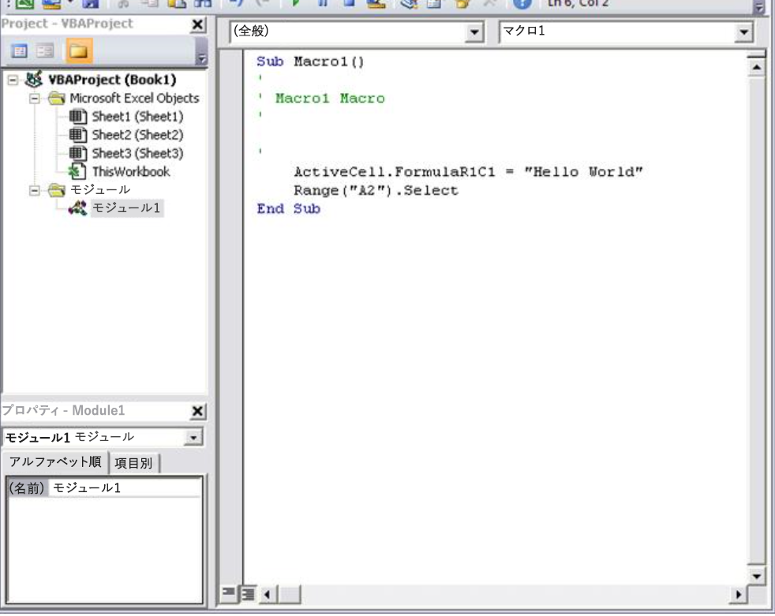
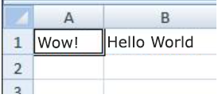
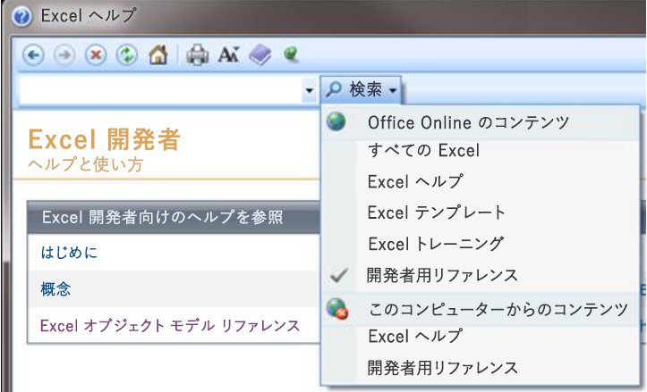

# Office VBA ?????
???????Visual Basic for Applications (VBA) ???????????? Office ????????????? 

## Office ?? VBA ???????
<a name="odc_office14_ta_AddingVBAProgrammingToYourOfficeToolkit_VBAProgrammingInOffice"> </a>

?????????VBA ???????????????Office ????????????????????????????????????????????? Office ????????????????

Office ???????? ?????????????????????????????????????????????????????????????????????????????????????????????????Office ???? VBA ??????????????????????????????????????? ????????????????????? VBA ?????????????????????? VBA ????????????????????100 ??????????????? (??????????????????????Office ??????? VBA ??????)?

VBA ????????????????????Office ?????????????????????????????? ??????????????????????????????????????????????????????????????????????????? ?????????????????????? ??????????????VBA ???????????????

?????VBA ??????????????????????????VBA ???????????????????????????????????????????????????????????????????????????????????????????????????


## Office ??????? VBA ??
<a name="odc_office14_ta_AddingVBAProgrammingToYourOfficeToolkit_VBAProgrammingInOffice"> </a>

[Access](http://msdn.microsoft.com/library/0e9c6fa4-3289-4a13-b409-354c70129308%28Office.15%29.aspx)

[Excel](http://msdn.microsoft.com/library/9c1e8386-0309-c52c-856b-963220382eb8%28Office.15%29.aspx)

[Outlook](http://msdn.microsoft.com/library/75e4ad96-62a2-49d2-bc51-48ceab50634c%28Office.15%29.aspx)

[PowerPoint](http://msdn.microsoft.com/library/db64b49a-e02f-4c53-a488-81c017dcea57%28Office.15%29.aspx)

[Project](http://msdn.microsoft.com/library/547d1948-312f-456a-9f7b-8097ec46a436%28Office.15%29.aspx)

[Publisher](http://msdn.microsoft.com/library/f6205a28-3858-4c73-b291-65e56a2fc015%28Office.15%29.aspx)

[Visio](http://msdn.microsoft.com/library/b6834d21-5898-4dd9-af2b-9ffeb1b92a1c%28Office.15%29.aspx)

[Word](http://msdn.microsoft.com/library/3080c270-5198-4b4f-922d-cb13e4b71bb3%28Office.15%29.aspx)

[](http://msdn.microsoft.com/library/9c1e8386-0309-c52c-856b-963220382eb8%28Office.15%29.aspx)


## VBA ??????????
<a name="odc_office14_ta_AddingVBAProgrammingToYourOfficeToolkit_WhenAndWhyToUseVBA"> </a>

Office ? VBA ?????????????????????? 3 ?????????


### ?????????

VBA ???????????????????????????????????????????????????????????Word ????????????????????????????????????Excel ?? Word ????? Outlook ???????????????????????????????????????????????????? Outlook ?????????????????????????

??? 10 ???? 20 ???????????????VBA ????????????????????????????????????????VBA ????????????????????????????????????????????VBA ??????????????


### ?????????????

??????????????????????????Office ?????????????????????????????????????????????????????????????????????????????????????????????????????????????


### Office ????????????

Outlook ?????????? Word ??????????????????????????????????????Excel ?????? PowerPoint ?????????????????????????????????????????????????????????????????????VBA ????????????????? 2 ???? Office ????????????????????????????????????????????????????????????????????????????


### ?????????

VBA ??????????????????????????????????????????????????????????????????????????

??????????????????????VBA ???????????????????????????????????????????????????????????????????????????????????? ??????????????????????????????????????????Ctrl + Y ?? (????) ?????????????????????????????????????????????????????????????????????????????????????? 

Office ??????????????????????????????????????????????????????????????????????Office ??????????????????

VBA ??????????????VBA ?????????????????????????????????????????????????????????????????????????????????????????????????????????????????????????????????????????"???????????" ?????????????????????????????????????????????????????????????????????????


## VBA ??????????
<a name="odc_office14_ta_AddingVBAProgrammingToYourOfficeToolkit_VBAProgramming101"> </a>


### ?????????????????????????

?????????????????????????????????????????????????????????????????Microsoft Office ??????????????????????????????????????????????????????????????????????????????????????????????????????????????????????????????????????????????????????????????????????????????????????????????????????????????????????????????????????????????????????????????????????????????????????

???????? Word ??????????????????????????????VBA ?????????????Word ? Document ?????????????VBA ?????????Document ?????????? Open?Save?Close ??????????????????

??????????????????????????????????


#### ?????? ???

??????? ?????????????????????????????????? "?????? ???" ???????????Word ???????? Application ?????????Document ???????????????? Document ???????? Paragraph ????????????????????????????????? ????????? ???????????????????????????????????????????????????????? ??????

?????????? "???" ??????????????????????????????????????????????????????????? ("???????") ???????????????????????????

??????????????????????? "?????" ???????"????" ???????????????????????????????????????????????????????????????????????????????????????????????????????????????????????????????????????????????????????????????

????? VBA ????????? Office ???????????????????????????????????????????????????????????????????????????? (Application)?Excel ? Worksheet ?Word ? Document ?PowerPoint ? Presentation ?Outlook ? Explorer ??? Folder ????????????????????? ?????????????????????????????????????????? Application ???????????????????Office ?? VBA ????? Office ?????????????????????????????


#### ????

?????Word ?????? Word ????????????????????????? **Application** ??????? **ActiveDocument** ?????????????? **ActiveDocument** ???????Word ?????????????????????? **Document** ????????????????"~???????" ???"~?????????????" ?????????

???????????????????????????????????????????????????


```VB.net
Application.ActiveDocument.Save
```

?????????????????"?? Application ???ActiveDocument ????????? Document ??????Save ?????????" ?????????Save ?????????????????????????????????????????????? **Document** ??????? **Save** ????????????????????????????????

????????????????????????????? "??????" ?????????????? **SaveAs** ??????????????????????????????????????????


```VB.net
Application.ActiveDocument.SaveAs ("New Document Name.docx")
```

????????????????????????????????????????????????  **SaveAs** ??????????????


#### ?????

??????????????????????????????????????????Excel ???? A1 ????????????????????????????????????????


```VB.net
    Application.ActiveSheet.Range("A1").Select
    Application.Selection.Value = "Hello World"
```

VBA ?????????????????????? Office ??????????????? ??????????????????????????????????????????????? ???????? Office ???????????????????????????????????????????????????????????

????? ?????? 1 ????  **Application** ?????? (???? Excel) ?????????????????????????????????? **ActiveSheet** ?????????????????????????Range ??"??????????????" ?????????????? **Range** ?????A1 ??????????????????????????????????????????? 1 ???? Range ????????????????????????????????????? **Application** ??????????? **Selection** ????????????

???? 2 ???? **Selection** ? **Value** ?????????? "Hello World" ??????????? A1 ???????

?????????????? VBA ????????? Office ???????????????????????????????????????????????VBA ?????????? Word ????????????????????????? 

?????????????????????????????????????????????????????????????????????????????????????????????????????????????????????????? 10 ????? 1000 ??????????????????????????????????? ???????????????????VBA ?????????????????????????


### ???? Visual Basic Editor

??? Office ????????????????????? ?????????????????????????????????????????????????????????????????????????????????????????????????????Office ?????????????????????????????????? Visual Basic Editor ??????????????????????????????????????????????????????????????


#### [??] ?????

???? Office ??????????????????????????????  **[??]** ?????Visual Basic Editor ????????????????????????Office ? **[??]** ??????????????????????????????????


### [??] ??????????


1. [ **????**] ??? [ **?????**] ??????? [ **?????**] ????? ???????????
    
2. ????? ?????????? [ **??????????**] ?????????
    
3. ????? ?????????? [ **???????**] ??[ **????????**] ???????
    
4. ????? ?????????? [ **??????????**] ???????? ????? [ **??? ??**] ?????[ **??**] ???? ????????????
    
5. [ **OK**] ?????????
    

 **??**  Office 2007 ? [??] ??????????Office ??????????[ **?????**] ????????? [ **?????**] ????? ????? [ **????**] ????? [ **[??] ???????????**] ???? ???????????????

[ **??**] ????????????? [ **Visual Basic**] ???? [ **???**] ??????????????????


**? 1. [??] ??????**

![[??] ??????](images/a3f71a29-06f2-4ee5-8c30-5dc60ad2ed31.png)


#### ?????????

Office ????????????????? ??????????????????????????????? Office ?????? ??????????????????????? ???????????????????????????????????????? .docx ???????? Word ????????????????, .docm ????????? Word ????????????????????

.docm ?????????Office ???????????????????????????????????????????????????????????????????????? Office ??????????????? ????????????????????????????????????????????????????????????????????????????????????????????????????????

????????????????????????????????????????????????????????????????????????????????????????????????????????????????????????????????????? Office ?????????????????????????? **[?????]** ????? ???????? **[?????? ????]** ??????? **[?????? ???????]** ???????????????


 **??**  Outlook ?????? Office ?????????????????????? ???????????? ??????????????????????????????????????????????????????????????????????????????????????


#### ??????

[ **??**] ??? [ **???**] ????????????[ **???**] ????? ?????????????????????????????????????????? VBA ??????????????????????[ **Visual Basic**] ????????????Visual Basic Editor ??????VBA ????????????????????

Word ??? Excel ?  **[??]** ???? **[??????]** ??????????????????????????????????????????????? VBA ??????????????? **[??????]** ??VBA ?????????????????????????????????????????? VBA ??????????????????????? Office ??????????????????????????????????1 ????????????????????????????????????????????????????????????????????????????????????


### ??????????


1. Excel ???????????????  **[??]** ??????????? **[??????]** ??????? **[??????]** ????? ?????????????????????????????????? "Macro1" ???????? "???????" ??????
    
2. ????????????? [ **OK**] ??????????????????????? [ **????**] ??????????????????????????????????????????????
    
3. ?? B1 ??????????????????????????????Hello World???????????????? **[????]** ????????????????????????????????????????????? Excel ???????????
    
4. ?? B2 ??????? ?? B1 ????????????[ **????**] ?????????
    
5. [ **??**] ??? [ ** ???**] ??????????????????? [ **Macro1**] ?????[ **??**] ??????? Macro1 ????? Visual Basic Editor ???????
    

**? 2. Visual Basic Editor ????? ???**




#### ???????

?????????????????????????????


```VB.net
Sub Macro1()
'
' Macro1 Macro
'
'
    Range("B1").Select
    ActiveCell.FormulaR1C1 = "Hello World"
    Range("B2").Select
End Sub
```

?? A1 ???????????????? ??????????????????????????????????? B1 ??????????? "Hello World" ????????????????????????????????????????????????????????????? 

[ **????**] ??????????????? B2 ???????????????????????????????? 1 ???????????? ?????????????????????????

??????????????????????????????????????????????????????????????????????????????????????????????VBA ?????????????????????????????????????????????????????????????????????????????????????????????????????????????? 4 ??????????????

??? ??????????????????????????????????????????????????????????????????????????????????????????????????????????????????????? ?????????  **ForumulaR1C1** ????????????????????????????????????????????????????


 **???**  ?? :  **Application** ??????????? VBA ?????????????????????????????? **Application.** ????????


#### ???????

????????  **ForumulaR1C1** ?????F1 ??????????? ????????????Excel ???? Excel ??????? ????????????????????????????? **FormulaR1C1** ????????????????????????????????????????????????????????? **[Excel ?????? ??? ??????]** ????????????????????????????????? Excel ??????? ????????????????????????????????????????????????????????????????????????????????????????????????????????????????????????????????????????????????????????? ?????????????????? **Borders** ????????????????? VBA ??????????????????


```VB.net
Worksheets(1).Range("A1").Borders.LineStyle = xlDouble
```


#### ??????

?? Borders ?????????????????????????????? ??????????? 1 ???????????? (?????? A1) ????????????????? 

?????????????????????????????????????????????????????????????????????????????????????????Macro1 ? Visual Basic Editor ???????????????????????


```VB.net
Sub Macro1()
    Worksheets(1).Range("A1").Value = "Wow!"
    Worksheets(1).Range("A1").Borders.LineStyle = xlDouble
End Sub
```


 **???**  ?????????????????????????????????????????? 

??????????????????????????Excel ?????? **[??]** ??? **[???]** ??????? **[Macro1]** ??????? **[??]** ??????????? A1 ????? "Wow!" ??????????????????????????????


**? 3. ???????????**



??????????????????? ???????????????????????????????????? VBA ???????????????????

???????????????VBA ???????????????????


## ??????????????
<a name="odc_office14_ta_AddingVBAProgrammingToYourOfficeToolkit_ProgrammingTipsAndTricks"> </a>


### ??????????

VBA ??????????????????Web ????????????????????????????? VBA ????????????????????????????????????????????????????????????????????????????????????????????????????????????????????????????

????????????????????????? Web ??????????????????????????????????????????????????????????????VBA ????????????????????????????????????????????????????????????????????????????????????????????????????????????????????? VBA ???????????????????????


### ????????

????????????????????????????????????????????????????????????????????????????????????????????????????????????????????????????????????????????????????????????????????????????????????????????????????????????????????????????????????????????????????????? 


### ???????

??????? ???????? 2 ??????????"??" ????????????????????????????"???"?????????????????? VBA ???????????????????

?????????????????????????????????????????????????????Visual Basic Editor ????????????????????????

?????VBA ??????????????????????????????????????Visual Basic Editor ????????? "Wow!" ???? 'Wow!' (Wow ??????????????) ?????????????????????????Visual Basic Editor ??????????????? "????? ??? : ???? : ?" ??????????????????????????????????????????????????????????????????????????

[ **OK**] ???????????? "Wow!" ??????

???????????????????????????????????????????????????VBA ?????????????????????????

?????Visual Basic Editor ????????  **Value** ?????????ValueX ???????????????????????????? **Range** ???????? ValueX ??????????????????????Excel ?????? **[???]** ????? ????????? Macro1 ????????????????????????????? "??????????????????????????????????" ??? Visual Basic ??????????????????????????????????????????????? [????] ?????????

Visual Basic Editor ???????????? ????????????????????????????????????????ValueX ????????????????????????


**? 4. ???? Visual Basic ?????**


???? VBA ????????????ValueX ? **Value** ????[ **????**] ????????????????????????????????????????????????

??????????????????????????????????????????????????????????????????????????????????????????????????????????????????????????????????????????????????? 1 ?????????????????????????????????????? [ **????**] ????????????????????????????????????????????? ?????????????????????


### ?????????

Office ????????????????????????????????? Office ????????????????????????? F1 ????????? ??????????????????????????????  **[??]** ??????????????????????? **[??????????]** ?????????????????????????????????????????????????????????????? ?????????????????


**? 5. ???????????????????? Office ??????????????**



?????? ?????????????????????????????????VBA ?????????? Office ??????????????? ??????????????????????????????????????????

??????[Office ?????? ????](http://msdn.microsoft.com/ja-jp/office/default.aspx)??????????????????????????????????????


### ?????????????

?????????????????????????????????????????????????????????????????????????????????????????????????????????????????????????????????????????

Web ? "office ??? ?????" ?????????????????? ????????????"office ??" ????????????????????????????????????????????????

??????????????????????????????????????????????????????????????????????????????????????????????????????????????

???????????????????????????????????????????


- ?????????????? FAQ????????????????????????????????????????????????????????????????????????????????????
    
- ????????????? ??????????????????????????????????????????????????????????????
    
- ???????????????????????????????????????????????????????????????????????????????????????????????????????????????????????????????????????
    
- ??????????????????????????
    

## ????????????
<a name="odc_office14_ta_AddingVBAProgrammingToYourOfficeToolkit_GoingFurtherWithProgramming"> </a>

???????? VBA ?????????????????????????????????????????????????????

????????????????????????????


### ??

????????????? ?????????????????????????????????????????????????????????????????????????????????????????????????????????????????????

VBA ????????????????????????????? **Dim** ??????????? VBA ?????????????????????????????????????????????????????????????


```VB.net
    Dim MyStringVariable As String
    MyStringVariable = "Wow!"
    Worksheets(1).Range("A1").Value = MyStringVariable
```


### ??????

???????????????????????? 1 ???????????????????????????????1 ????????????????????????????????????????????????????????????????????????????????????????????Macro1 ??????? 


```VB.net
Sub Macro1()
    If Worksheets(1).Range("A1").Value = "Yes!" Then
        Dim i As Integer
        For i = 2 To 10
            Worksheets(1).Range("A" &amp; i).Value = "OK! " &amp; i
        Next i
    Else
        MsgBox "Put Yes! in cell A1"
    End If
End Sub
```

?????? Visual Basic Editor ???????????????????????????? ????????????? A1 ?????? Wow! ??Yes! ??????????????????????????????????? ????????????????????????????????????????????????????????????????????????????????????


## ???? Office ???? ???
<a name="odc_office14_ta_AddingVBAProgrammingToYourOfficeToolkit_AllOfMyOfficeAppsExampleCode"> </a>

??????????????????????????????? Office ???????????


### Outlook ???????????


```VB.net
Sub MakeMessage()
    Dim OutlookMessage As Outlook.MailItem
    Set OutlookMessage = Application.CreateItem(olMailItem)
    OutlookMessage.Subject = "Hello World!"
    OutlookMessage.Display
    Set OutlookMessage = Nothing
End Sub
```

????????Outlook ??????????????????????????????????????????????????


### Excel ????????????????


```VB.net
Sub DeleteEmptyRows()    SelectedRange = Selection.Rows.Count    ActiveCell.Offset(0, 0).Select    For i = 1 To SelectedRange        If ActiveCell.Value = "" Then    
            Selection.EntireRow.Delete        Else            ActiveCell.Offset(1, 0).Select        End If    Next iEnd Sub
```

?????????????????????????????????????????????????


### PowerPoint ??????? ?????????


```VB.net
Sub RemoveEmptyTextBoxes()
    Dim SlideObj As Slide
    Dim ShapeObj As Shape
    Dim ShapeIndex As Integer
    For Each SlideObj In ActivePresentation.Slides
        For ShapeIndex = SlideObj.Shapes.Count To 1 Step -1
            Set ShapeObj = SlideObj.Shapes(ShapeIndex)
            If ShapeObj.Type = msoTextBox Then
                If Trim(ShapeObj.TextFrame.TextRange.Text) = "" Then
                    ShapeObj.Delete
                End If
            End If
        Next ShapeIndex
    Next SlideObj
End Sub
```

?????????????????????????????????????????????????????? ??????????????????????1 ?????????????????????????????? 1 ?????????????????????????????????????????


### ???? Outlook ?? Word ??????


```VB.net
Sub CopyCurrentContact()
   Dim OutlookObj As Object
   Dim InspectorObj As Object
   Dim ItemObj As Object
   Set OutlookObj = CreateObject("Outlook.Application")
   Set InspectorObj = OutlookObj.ActiveInspector
   Set ItemObj = InspectorObj.CurrentItem
   Application.ActiveDocument.Range.InsertAfter (ItemObj.FullName &amp; " from " &amp; ItemObj.CompanyName)
End Sub
```

?????????? Outlook ???????????Word ???????????????????????????????????? Outlook ??????????????????????????


## ????????
<a name="odc_office14_ta_AddingVBAProgrammingToYourOfficeToolkit_AllOfMyOfficeAppsExampleCode"> </a>

[Office VBA ????????](http://msdn.microsoft.com/library/9c1e8386-0309-c52c-856b-963220382eb8%28Office.15%29.aspx)

