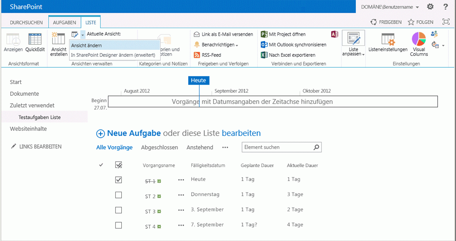

# Application.AddSiteColumn-Methode (Project)
Fügt eine Spalte, die für die Aufgabenliste in der synchronisierten SharePoint-Website für das aktive Projekt verfügbar ist.

## Syntax

 _Ausdruck_. **AddSiteColumn** _(ProjectField_,  _SharePointName)_

 _Ausdruck_ Eine Variable, die ein Objekt Application **Application** repräsentiert.


### Parameter


|**Name**|**Erforderlich/Optional**|**Datentyp**|**Beschreibung**|
|:-----|:-----|:-----|:-----|
| _ProjectField_|Optional|**[PjField](f0df0929-921c-1f33-ab42-192efdaeb64d.md)**|Eine Teilmenge von Konstanten in der  **PjField** -Aufzählung, möglich die Projektfelds in der neuen Spalte anzuzeigenden angibt; eines der Felder verbotene nicht möglich (siehe Hinweise).|
| _SharePointName_|Optional|**Variant**|Der Name der neuen Spalte.|
| _ProjectField_|Optional|PJFIELD||
| _SharePointName_|Optional|Variant||
|Name|Erforderlich/Optional|Datentyp|Beschreibung|

### Rückgabewert

 **Boolean**

 **True**, wenn die Spalte hinzugefügt wird.


## Hinweise

Die  **AddSiteColumn** -Methode gibt Laufzeitfehler 1004, "anwendungsdefinierte oder objektdefinierter Fehler;" in den folgenden Fällen:


- Das aktive Projekt ist nicht mit einer synchronisierten SharePoint-Vorgangsliste verknüpft. Wenn das Projekt lokal ist, können Sie die  **LinkToTaskList** -Methode zum Erstellen einer synchronisierten SharePoint-Vorgangsliste verwenden.
    
- Den Namen der Spalte in der SharePoint-Aufgabenliste ist bereits vorhanden. Um die Liste der Spaltennamen angezeigt wird, öffnen Sie die Aufgabenliste in SharePoint, und wählen Sie dann auf der Registerkarte  **Liste** **Ansicht ändern**. Die Einstellungen  **? Bearbeitungsansicht** Seite zeigt alle die Spaltennamen, die für die Aufgabenliste verfügbar sind.
    
- Der  _ProjectField_ -Wert ist eine nicht-Vorgang dar, wie etwa **pjResourceActualCost**. Eine SharePoint-Aufgabenliste zeigt Vorgangsfelder, nicht-Ressourcenfelder enthalten.
    
- Der  _ProjectField_ -Wert ist ein benutzerdefiniertes Enterprise-Feld wie **pjTaskEnterpriseProjectText1**oder ein Nachschlagefeld Tabelle wie  **pjTaskResourceEnterpriseRBS**. Lokale benutzerdefinierte Vorgangsfelder, wie etwa  **pjTaskText1**, sind zulässig.
    
- Der Wert  _ProjectField_ ist eine verbotene Felder in Tabelle 1. Diese Felder sind zusätzlich zu den verbotene Ressourcenfelder und benutzerdefinierte Enterprise-Felder. Die Felder sind nicht zulässig, da sie mit anderen unzulässigen Feldern verknüpft sind, oder über Werttypen, die in einer standardmäßigen SharePoint-Vorgangsliste nicht unterstützt werden.
    
    Obwohl in Tabelle 1 und die anderen verbotene Felder angezeigt werden können, eine lange Liste, der in  **PjField**, 1,338-Konstanten sein sind 357?including lokale Vorgangs benutzerdefinierte fields?that kann mit der  **AddSiteColumn** -Methode verwendet werden.
    

    **In Tabelle 1. Zusätzliche verbotene Felder**

||||
|:-----|:-----|:-----|
|**pjTaskActive**|**pjTaskActualOvertimeWork**|**pjTaskACWP**|
|**pjTaskAssignmentDelay**|**pjTaskAssignmentPeakUnits**|**pjTaskAssignmentUnits**|
|**pjTaskBaseline[1-10]BudgetCost**|**pjTaskBaseline[1-10]BudgetWork**|**pjTaskBaseline[1-10]FixedCostAccrual**|
|**pjTaskBaselineBudgetCost**|**pjTaskBaselineBudgetWork**|**pjTaskBaselineFixedCostAccrual**|
|**pjTaskBudgetCost**|**pjTaskBudgetWork**|**pjTaskCalendarGuid**|
|**pjTaskConstraintDate**|**pjTaskConstraintType**|**pjTaskCostRateTable**|
|**pjTaskDeliverableGuid**|**pjTaskDeliverableType**|**pjTaskDemandedRequested**|
|**pjTaskEarnedValueMethod**|**pjTaskEnterpriseOutlineCode[1-30]**|**pjTaskExternalTask**|
|**pjTaskFinishSlack**|**pjTaskFixedCostAccrual**|**pjTaskFreeSlack**|
|**pjTaskGuid**|**pjTaskHideBar**|**pjTaskHyperlink**|
|**pjTaskHyperlinkAddress**|**pjTaskHyperlinkHref**|**pjTaskHyperlinkScreenTip**|
|**pjTaskHyperlinkSubAddress**|**pjTaskID**|**pjTaskIgnoreWarnings**|
|**pjTaskIndicators**|**pjTaskIsAssignment**|**pjTaskLevelAssignments**|
|**pjTaskLevelDelay**|**pjTaskLinkedFields**|**pjTaskManual**|
|**pjTaskMilestone**|**pjTaskNotes**|**pjTaskObjects**|
|**pjTaskOutlineCode[1-10]**|**pjTaskOutlineLevel**|**pjTaskOutlineNumber**|
|**pjTaskPathDrivenSuccessor**|**pjTaskPathDrivingPredecessor**|**pjTaskPathPredecessor**|
|**pjTaskPathSuccessor**|**pjTaskPreleveledFinish**|**pjTaskPreleveledStart**|
|**pjTaskPriority**|**pjTaskResourceType**|**pjTaskStartSlack**|
|**pjTaskStatus**|**pjTaskStatusIndicator**|**pjTaskSubproject**|
|**pjTaskSubprojectReadOnly**|**pjTaskTotalSlack**|**pjTaskType**|
|**pjTaskWarning**|**pjTaskWorkContour**|****|
Es ist möglich, ein Feld, das bereits in der Aufgabenliste vorhanden ist, wenn Sie einem eindeutigen Namen für die  _SharePointName_ parameter?although den Wert dieser Vorgehensweise verwenden also fragwürdige hinzufügen.


## Beispiel

Verwenden Sie das Makro  **AddDurationColumns**, erstellen eine Aufgabenliste in einer SharePoint-Website, erstellen Sie ein Projekt in Project Professional, und klicken Sie dann die **LinkToTaskList** -Methode verwenden, um die Aufgabenliste zu importieren. Legen Sie einen Basisplan für das aktive Projekt mithilfe des Befehls **Basisplan festlegen** auf der Registerkarte **Projekt** im Menüband, und ändern Sie die Dauer einiger Vorgänge.

Das Makro  **AddDurationColumns** Vorgangsdauer und geplante Dauer der Liste der verfügbaren Spalten in der SharePoint-Aufgabe hinzugefügt (siehe Abbildung 1).


 **Hinweis**  Nach der Ausführung des Makros  **AddDurationColumns** müssen Sie das Projekt in Project Professional auf Ihre Änderungen bei der SharePoint-Aufgabenliste synchronisieren speichern.


```
Sub AddDurationColumns()
    Dim success As Boolean
    Dim results As String
    Dim columnName As String
    Dim fieldName As PjField
    results = ""
    
    ' Add the first column.
    fieldName = pjTaskBaselineDurationText
    columnName = "Baseline duration"
    
    ' If the field name exists in the SharePoint tasks list, or fieldName
    ' is one of the prohibited fields, the AddSiteColumn method
    ' returns error 1100.
    On Error Resume Next
    
    success = AddSiteColumn(fieldName, columnName)
    
    If success Then
        results = "Added site column: " &amp; columnName
    Else
        results = "Error in AddSiteColumn: " &amp; columnName
    End If
    
    ' Add the second column.
    fieldName = pjTaskDurationText
    columnName = "Current duration"
    
    success = AddSiteColumn(fieldName, columnName)
    
    If success Then
        results = results &amp; vbCrLf &amp; "Added site column: " &amp; columnName
    Else
        results = results &amp; vbCrLf &amp; "Error in AddSiteColumn: " &amp; columnName
    End If
    
    Debug.Print results
End Sub
```

Nachdem Sie das Projekt gespeichert haben, fahren Sie mit der Aufgabenliste in SharePoint. Wählen Sie auf der Registerkarte  **Liste** den Befehl **Ansicht ändern**. Klicken Sie auf die Einstellungen - bearbeiten Sie Seite Ansicht, wählen Sie das Feld  **Geplante Dauer** und das **aktuelle Dauer** dar, das das Makro **AddDurationColumns** hinzugefügt. Abbildung 1 zeigt die Aufgabenliste mit zwei neue Felder.


**Abbildung 1. Hinzufügen von Feldern zu einer synchronisierten SharePoint-Aufgabenliste**




## Siehe auch


#### Konzepte


[Application-Objekt](8eb91712-7784-a102-38c0-19bb056c27e9.md)
[PjField-Enumeration](f0df0929-921c-1f33-ab42-192efdaeb64d.md)
#### Weitere Ressourcen


[LinkToTaskList-Methode](65ae7bd0-446f-74dd-15fc-0a260342be90.md)