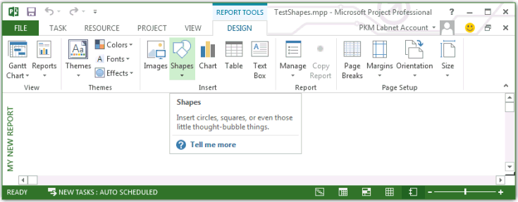

# Report-Objekt (Projekt)
Stellt einen Bericht im Projekt, das Office Art-Objekte wie  **Shape**,  **ReportTable**oder  **Chart**enthalten kann. Das  **Report** -Objekt ist ein Mitglied der **Reports** -Auflistung.

## Hinweise


 **Hinweis**  Makroaufzeichnungen für das  **Report** -Objekt ist nicht implementiert. D. h., wenn Sie ein Makro in Project aufzeichnen und manuell eines Berichts hinzufügen oder eines Berichts bearbeiten, werden die Schritte zum Hinzufügen und bearbeiten den Bericht nicht aufgezeichnet.


## Beispiel

Wenn Sie einen Bericht erstellen, verwenden Sie die  **[Reports.Add](3ce8e51c-54c6-6cc7-f5ec-c27e0a657f04.md)** -Methode. Der folgende Befehl wird beispielsweise einen Bericht mit dem Namen My neuer Bericht erstellt.


```
ActiveProject.Reports.Add "My New Report"
```

Wenn Sie den Befehl ausführen, Projekt erstellt den Bericht und ändert sich die Ansicht in der Registerkarte  **Entwurf** des Menübands, klicken Sie unter **BERICHTSTOOLS**. Die Elemente der Design-Tool können auf dem Menüband Sie Formen, Bilder, Diagramme, Tabellen oder Textfelder mit dem Bericht hinzufügen. Alternativ können Sie programmgesteuert hinzufügen und Bearbeiten von Elementen in den Bericht werden mithilfe von Membern der  **Shape**,  **ShapeRange**,  **Chart**und  **ReportTable** -Objekte.


**Abbildung 1. Erstellen eines Berichts in Project**

Um einen Bericht zu löschen, müssen Sie zunächst die Ansicht des aktiven Bericht schließen. Wählen Sie einen anderen Bericht beispielsweise auf der Registerkarte  **Entwurf** des Menübands in der Gruppe **Ansicht** im Dropdown-Menü **Berichte**. Wählen Sie dann in der Gruppe  **Bericht** auf dem Menüband **Organizer** im Dropdown-Menü **Verwalten**. Klicken Sie im Dialogfeld  **Organisieren** wählen Sie die Registerkarte **Berichte**, wählen Sie  **Meine neuen Berichts** im Projekt, und wählen Sie dann auf **Löschen**.

Um den aktiven Bericht programmgesteuert zu löschen, führen Sie das folgende Makro.


```
Sub DeleteTheReport()
    Dim i As Integer
    Dim reportName As String
    
    reportName = "My New Report"
    
    ' To delete the active report, change to another view.
    ViewApplyEx Name:="&amp;Gantt Chart"
    
    ActiveProject.Reports(reportName).Delete
End Sub
```


## Siehe auch


#### Weitere Ressourcen


[Chart-Objekt](810d4ec1-69d2-c432-b9da-57042b783b85.md)
[Reports-Objekt](a9f4a13b-1907-dbe8-8077-fb1226bb8bb9.md)
["ReportTable"-Objekt](db9846c7-fd53-ae5a-7a43-35dfc60f4fe4.md)
[Shape-Objekt](d2b32bcd-5595-a4a7-9772-feb25fd0103a.md)
[ShapeRange-Objekt](315031aa-4b8c-424b-26e7-ce15897beb05.md)