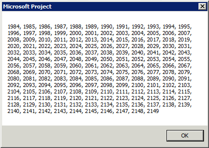

# Years Object (Project)

Enthält eine Auflistung von  **[Year](060e541f-f709-65dd-c955-5d04c1554373.md)** -Objekten.


## Bemerkungen

Die  **Years** -Auflistung in Project beginnt mit 1984 und endet in 2149. In früheren Versionen von Project kann Planen von 1984 bis 2049 ausführen.


## Beispiele

 **Verwenden des Year-Objekts**

Verwenden Sie  **Jahren** ( _Index_), wobei  _Index_ die Indexnummer des Jahres ist, um ein einzelnes **Year** -Objekt zurückzugeben. Im folgenden Beispiel wird ermittelt die Anzahl von Arbeitstagen im Monat September 2012 für jede ausgewählte Ressource.


```
Dim r As Resource
Dim d As Integer
Dim workingDays As Integer
Dim theMonth As PjMonth

theMonth = pjSeptember

For Each r In ActiveSelection.Resources()
    workingDays = 0
    With r.Calendar.Years(2012).Months(theMonth)
        For d = 1 To .Days.Count
            If .Days(d).Working = True Then
                workingDays = workingDays + 1
            End If
        Next d
    End With
    MsgBox "There are " &amp; workingDays &amp; " working days in " _
        &amp; r.Name &amp; "'s calendar for month " &amp; theMonth
Next r
```

 **Verwenden der Years-Auflistung**

Verwenden Sie die  **[Years](63f17754-d258-3fd2-5f20-33b8998e7e4d.md)** -Eigenschaft, um eine **Years** -Auflistung zurückzugeben. Im folgenden Beispiel werden alle Jahre im Kalender des aktiven Projekts aufgelistet.


```
Sub CountYears()
    Dim c As Long
    Dim temp As String
        
    For c = 1 To ActiveProject.Calendar.Years.Count
        temp = temp &amp; ListSeparator &amp; " " &amp; _
            ActiveProject.Calendar.Years(c + 1983).Name
    Next c
            
    MsgBox Right$(temp, Len(temp) - Len(ListSeparator &amp; " "))
End Sub
```

Abbildung 1 zeigt die Ergebnisse des  **CountYears** Makros.


**Abbildung 1. Abrufen der Liste der zur Verfügung stehende Jahre**




## Siehe auch


#### Konzepte


[Projektobjektmodell](900b167b-88ec-ea88-15b7-27bb90c22ac6.md)