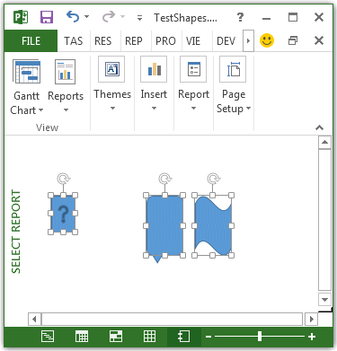

# ShapeRange.Select-Methode (Project)
Jeder Form markiert eines Formbereichs.

## Syntax

 _Ausdruck_. **Select** _(Replace)_

 _Ausdruck_ Eine Variable, die ein ShapeRange **ShapeRange**-Objekt darstellt.


### Parameter


|**Name**|**Erforderlich/Optional**|**Datentyp**|**Beschreibung**|
|:-----|:-----|:-----|:-----|
| _Replace_|Optional|**Variant**|**True** ersetzt die aktuelle Auswahl durch die neue Markierung. **False** hinzugefügt der aktuellen Markierung die neue Markierung. Der Standardwert ist **True**.|
| _Replace_|Optional|Variant||

### Rückgabewert

 **Nothing**


## Beispiel

Das folgende Beispiel erstellt drei Shapes, weist zwei Shapes auf den ersten Bereich, weist das andere Shape auf den zweiten Bereich und wählt dann die Formenbereiche. Da die erste Bereichsauswahl die zweite Bereichsauswahl hinzufügt, sind alle drei Shapes ausgewählt ist (siehe Abbildung 1).


```
Sub SelectShapes()
    Dim theReport As Report
    Dim shp1 As shape
    Dim shp2 As shape
    Dim shp3 As shape
    Dim reportName As String
    Dim sRange1 As ShapeRange
    Dim sRange2 As ShapeRange
    
    reportName = "Select Report"
    
    Set theReport = ActiveProject.Reports.Add(reportName)
    Set shp1 = theReport.Shapes.AddShape(msoShapeActionButtonHelp, 20, 50, 20, 30)
    Set shp2 = theReport.Shapes.AddShape(msoShapeBalloon, 100, 50, 30, 50)
    Set shp3 = theReport.Shapes.AddShape(msoShapeWave, 140, 50, 30, 50)
        
    Set sRange1 = theReport.Shapes.Range(Array(2, 3))
    Set sRange2 = theReport.Shapes.Range(1)
    
    sRange1.Select
    sRange2.Select False
End Sub
```


**Abbildung 1. Verwenden der Select-Methode zum Hinzufügen von einer Auswahl**




## Siehe auch


#### Weitere Ressourcen


[ShapeRange-Objekt](315031aa-4b8c-424b-26e7-ce15897beb05.md)