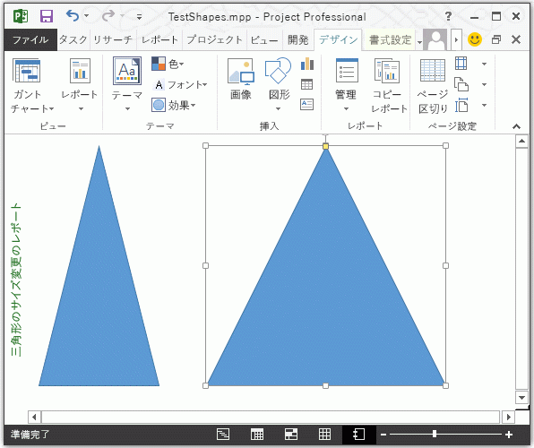

# Shape.LockAspectRatio プロパティ (プロジェクト)
図形のサイズを変更する際にその元の比率を保持するかどうか、つまり、図形の縦横比をロックするかどうかを示す値を取得するか設定します。 **[MsoTriState](http://msdn.microsoft.com/ja-jp/library/office/ff860737%28v=office.15%29)** の値の取得と設定が可能

## 構文

 _式_. **LockAspectRatio**

 _式_ **Shape** オブジェクトを表す変数。


## 解説

図形のサイズを変更しても元の比率を保持する場合、 **LockAspectRatio** 値は **msoTrue** です。図形の高さと幅を個別に変更できる場合、値は **msoFalse** です。


## 例

次の例では、同じサイズの三角形を 2 つ作成します。左の三角形は縦横比がロック解除され、右の三角形は縦横比がロックされています。図 1 は、各三角形に同じサイズ変更をした場合の結果を示します。


```
Sub ResizeTriangles()
    Dim shapeReport As Report
    Dim reportName As String
    Dim triangle1 As shape
    Dim triangle2 As shape

    reportName = "Triangle resize report"
    Set shapeReport = ActiveProject.Reports.Add(reportName)
    
    With shapeReport.Shapes
        Set triangle1 = .AddShape(msoShapeIsoscelesTriangle, 10, 10, 100, 100)
        Set triangle2 = .AddShape(msoShapeIsoscelesTriangle, 150, 10, 100, 100)
    End With
    
    triangle1.Select
    triangle1.LockAspectRatio = msoFalse
    triangle1.height = 200
    
    triangle2.Select
    triangle2.LockAspectRatio = msoTrue
    triangle2.height = 200
End Sub
```

図 1 では、縦横比がロックされている右の図形が選択されています。


**図 1.縦横比をロック解除またはロックした場合の図形のサイズ変更**




## プロパティ値

 **MSOTRISTATE**


## 関連項目


#### その他の技術情報


[Shape オブジェクト](d2b32bcd-5595-a4a7-9772-feb25fd0103a.md)
[ShapeRange.LockAspectRatio プロパティ](82d60445-a114-d060-a85b-6a631df4c2ab.md)
[MsoTriState](http://msdn.microsoft.com/ja-jp/library/office/ff860737%28v=office.15%29)