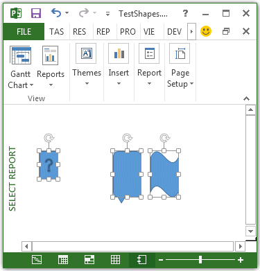

# Shape.Select メソッド (プロジェクト)
図形を選択します。

## 構文

 _式_. **Select** _(Replace)_

 _式_ Shape **Shape** オブジェクトを表す変数。


### パラメーター


|**名前**|**必須/オプション**|**データ型**|**説明**|
|:-----|:-----|:-----|:-----|
| _Replace_|省略可能|**Variant**|**True**は、現在の選択範囲を新しい選択範囲に置き換えます。 **False**は、新しい選択範囲を現在の選択範囲に追加します。既定値は、  **True**です。|
| _Replace_|省略可能|VARIANT||

### 戻り値

 **Nothing**


## 例

次の例では、3 つの図形を作成し、各図形を選択します。2 番目と 3 番目の選択は、最初の選択項目に追加するため、3 つすべての図形は、選択されている (図 1 参照) になります。


```
Sub SelectShapes()
    Dim theReport As Report
    Dim shp1 As shape
    Dim shp2 As shape
    Dim shp3 As shape
    Dim reportName As String
    
    reportName = "Select Report"
    
    Set theReport = ActiveProject.Reports.Add(reportName)
    Set shp1 = theReport.Shapes.AddShape(msoShapeActionButtonHelp, 20, 50, 20, 30)
    Set shp2 = theReport.Shapes.AddShape(msoShapeBalloon, 100, 50, 30, 50)
    Set shp3 = theReport.Shapes.AddShape(msoShapeWave, 140, 50, 30, 50)
            
    shp1.Select
    shp2.Select False
    shp3.Select False
End Sub
```


**図 1 です。Select メソッドを使用して、選択範囲に追加するのには**




## 関連項目


#### その他の技術情報


[Shape オブジェクト](d2b32bcd-5595-a4a7-9772-feb25fd0103a.md)