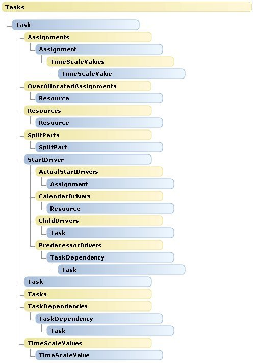
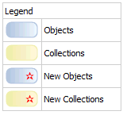

# Tasks object map (Project)

Projectの **Tasks**オブジェクトのマップでは、  **Tasks**コレクションのオブジェクトの子オブジェクトを示します。Projectから **Tasks**のオブジェクト階層内の変更はありません。

 **Tasks**コレクションは、  **Project**、  **Selection**、または別の **Task**の子であることができます。たとえば、  **Task.PredecessorTasks**および **Task.SuccessorTasks**プロパティは、  **Tasks**コレクションを返します。

 **Application**と **Project**のオブジェクトの概要については、  **Resources**と **Calendars**のコレクションの詳細については、次の操作を参照してください。

-  **[Application および Projects オブジェクト マップ](608f1291-ce25-8a5f-f0ba-7c1e823a12f4.md)**
    
-  **[Calendars オブジェクト マップ](dc7080e2-be59-ea63-096a-65af1737be42.md)**
    
-  **[リソース オブジェクト マップ](a98ea473-b3e0-1968-5718-0f4834d8449b.md)**
    

## Tasks オブジェクトの階層

 **メモ**  マニュアル ページを次の図のオブジェクトがリンクしません。

