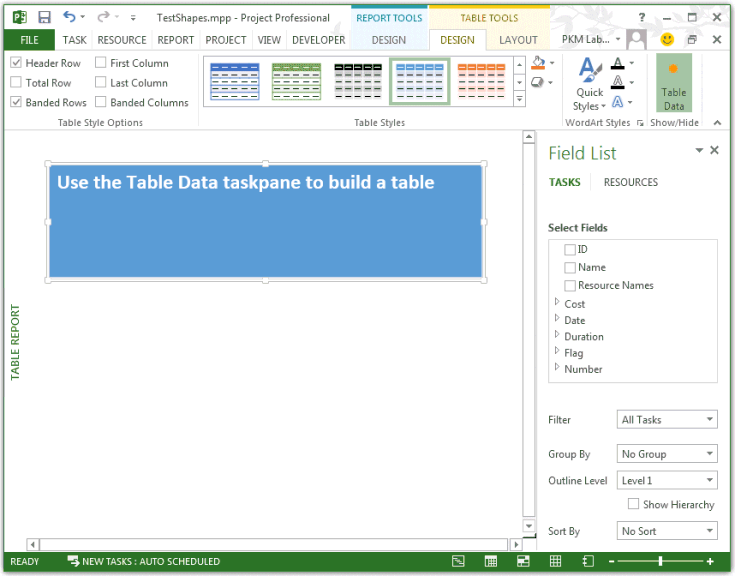
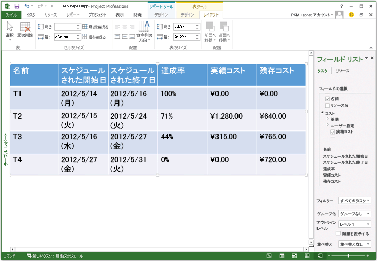

# Shapes.AddTable メソッド (プロジェクト)
レポートにテーブルを追加し、テーブルを表す **Shape**オブジェクトを返します。

## 構文

 _式_. **AddTable** _(NumRows,_ _NumColumns,_ _Left,_ _Top,_ _Width,_ _Height)_

 _式_ **Shapes** オブジェクトを表す変数。


### パラメーター


|**名前**|**必須/オプション**|**データ型**|**説明**|
|:-----|:-----|:-----|:-----|
| _NumRows_|必須|**Long**|テーブル内の行の数です。 _NumRows_は、テーブルの作成時に無視されます。|
| _NumColumns_|必須|**Long**|テーブル内の列の数です。 _NumColumns_は、テーブルの作成時に無視されます。|
| _Left_|必須|**Single**|左端からポイント単位で [レポート] ウィンドウの左側にあるからです。|
| _Top_|必須|**Single**|上端からポイント単位で [レポート] ウィンドウの最上部から。|
| _Width_|必須|**Single**|ポイントで、テーブルの幅。|
| _Height_|必須|**Single**|ポイントで、テーブルの高さ。|
| _NumRows_|必須|INT||
| _NumColumns_|必須|INT||
| _Left_|必須|FLOAT||
| _Top_|必須|FLOAT||
| _Width_|必須|FLOAT||
| _Height_|必須|FLOAT||
|名前|必須/オプション|データ型|説明|

### 戻り値

 **Shape**


## 注釈

プロジェクトでは、  _NumRows_と _NumColumns_ 、 **AddTable**メソッドは、テーブルを作成するときに無視します。1 つの行と **テーブルを作成するテーブルのデータ作業ウィンドウを使用して**テキストを含む 1 つの列があるテーブルを作成すると (図 1 を参照してください)。テーブルを選択すると、プロジェクトでは、という名前の **フィールド] ボックスの一覧**の **タスク**が既定で選択したテーブル データ] 作業ウィンドウが表示されます。 **フィールド リスト**] 作業ウィンドウを使用すると、レポートのフィールドを手動で追加できます。


**図 1 です。AddTable メソッドは、1 つの行と列を持つテーブルを作成します。**




## 例

 **TestReportTable**マクロは、図 1 に示すようにテーブルが作成され、 **テーブル データ**] 作業ウィンドウを表示するテーブルを選択します。


```
Sub TestReportTable()
    Dim theReport As Report
    Dim tableShape As shape
    Dim theReportTable As ReportTable
    Dim reportName As String
    Dim tableName As String
    Dim rows As Integer
    Dim columns As Integer
    Dim left As Integer
    Dim top As Integer
    Dim width As Integer
    Dim height As Integer
    
    reportName = "Table Report"
    Set theReport = ActiveProject.Reports.Add(reportName)
    
     ' Add the table.
    tableName = "Task information"
    rows = 0
    columns = 0
    left = 0
    top = 30
    width = 110
    height = 20
       
    ' Project ignores the NumRows and NumColumns parameters when
    ' creating a ReportTable.
    Set tableShape = theReport.Shapes.AddTable(rows, columns, _
                        left, top, width, height)
    
    tableShape.Name = tableName
    tableShape.Select
    Set theReportTable = tableShape.Table
    
    With theReportTable
        Debug.Print "Rows: " &amp; .RowsCount
        Debug.Print "Columns: " &amp; .ColumnsCount
        Debug.Print "Cell 1,1 contents:" &amp; vbCrLf &amp; vbTab; .GetCellText(1, 1)
    End With
End Sub
```

テーブルのフィールドを指定するには、  **UpdateTableData**メソッドを使用します。前のマクロで `Set theReportTable = tableShape.Table`行の後に、次のコードを追加します。 _OutlineLevel_パラメーターでは、レベル 1 のタスクを指定し、プロジェクトのサマリ タスクをフィルター処理します。


```
    ' Set fields for the table.
    Dim fieldArray(1 To 6) As PjField
        
    fieldArray(1) = pjTaskName
    fieldArray(2) = pjTaskStart
    fieldArray(3) = pjTaskFinish
    fieldArray(4) = pjTaskPercentComplete
    fieldArray(5) = pjTaskActualCost
    fieldArray(6) = pjTaskRemainingCost
        
    theReportTable.UpdateTableData Task:=True, OutlineLevel:=1, SafeArrayOfPjField:=fieldArray
```

達成率のさまざまな値を持つ 4 つのタスクおよびリソースのコストを持っているプロジェクトを変更した **TestReportTable**マクロを実行します。図 2 は、テーブルの結果の例です。


**図 2 になります。UpdateTableData メソッドは、テーブルにフィールドを追加できます。**




## 関連項目


#### その他の技術情報


[図形オブジェクト](6e42040c-dd5a-de4c-afa8-f9e33d1e5054.md)
[Shape オブジェクト](d2b32bcd-5595-a4a7-9772-feb25fd0103a.md)
[Application.Table メソッド](c00cd0bd-e653-685e-f646-b22f60a6e507.md)