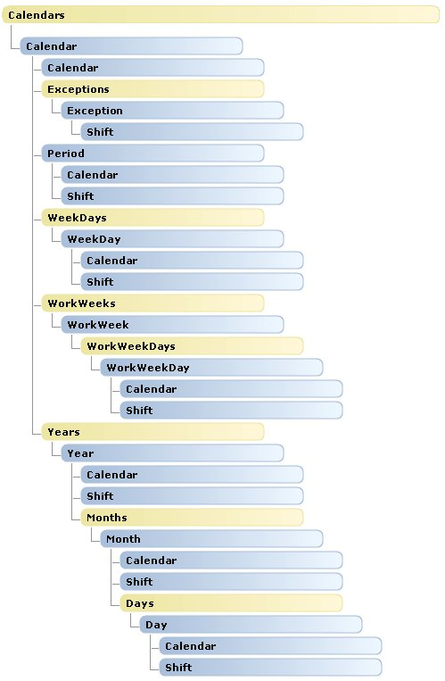

# Calendars object map (Project)

Projectの **Calendars**オブジェクトのマップでは、  **Calendars**コレクションのオブジェクトの子オブジェクトを示します。Projectから **Calendars**のオブジェクト階層内の変更はありません。

 **Calendars**は、  **Application**または **Project**の子であることができます。たとえば、  **Application.GlobalBaseCalendars**プロパティと **Project.BaseCalendars**プロパティは、  **Calendars**コレクションを返します。

 **Application**と **Project**のオブジェクトの概要については、  **Resources**と **Tasks**のコレクションの詳細については、次の操作を参照してください。

-  **[Application および Projects オブジェクト マップ](608f1291-ce25-8a5f-f0ba-7c1e823a12f4.md)**
    
-  **[リソース オブジェクト マップ](a98ea473-b3e0-1968-5718-0f4834d8449b.md)**
    
-  **[Tasks オブジェクト マップ](c6f63588-37bb-b5d9-c28d-d0a133e22b77.md)**
    

## カレンダー オブジェクトの階層

 **メモ**  マニュアル ページを次の図のオブジェクトがリンクしません。

