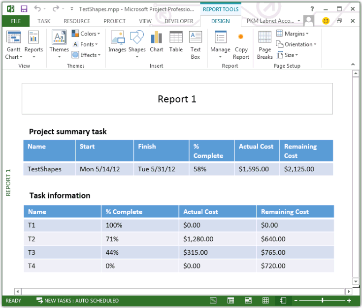

# ReportTable.GetCellText メソッド (プロジェクト)
 **ReportTable**オブジェクトで指定したセルのテキスト値を返します。

## 構文

 _式_. **GetCellText** _(Row,_ _Col)_

 _式_ **ReportTable**オブジェクトを表す変数です。


### パラメーター


|**名前**|**必須/オプション**|**データ型**|**説明**|
|:-----|:-----|:-----|:-----|
| _Row_|必須|**Long**|テーブル内の行番号です。|
| _Col_|必須|**Long**|テーブルの列数です。|
| _Row_|必須|INT||
| _Col_|必須|INT||

### 戻り値

 **String**

指定された表のセルのテキスト値。


## 注釈

返される文字列は、改行文字 ( `chr(10)`、  **vbCrLf**の文字に相当) で終了します。


## 例

アクティブなレポートのすべてのテーブルを検索します。 テーブル内の各セルの値を取得、(改行文字) の各値の最後の文字を削除および、VBE のイミディ エイト ウィンドウにテーブルのセルの値を出力に **GetTableText**の使用例です。 **GetTableText**マクロを使用する、[グラフ オブジェクト](810d4ec1-69d2-c432-b9da-57042b783b85.md)のトピックで指定されている例のようにの値を持つプロジェクトを作成し、次の操作を行います (図 1 を参照)、手順します。


1. 手動でレポートを作成します。などの [ **レポート**] ボックスの一覧で、リボンの [ **プロジェクト**] タブには、 **複数のレポート**を選択します。 **レポート**] ダイアログ ボックスで **新規**を選択して、左側のペインで、右側のペインで **空白**を選択し **を選択**します。 **レポート名**] ダイアログ ボックスで、[レポート 1]を入力します。
    
2. レポートには、2 つのテーブルを追加します。 **レポート ツール**の [リボンの [ **デザイン**] タブ、[ **挿入**] グループで **[テーブル**] コマンドを使用します。
    
3.  **名前**、 **開始**、 **終了**、およびプロジェクトのサマリー タスクの **達成率**フィールドを含む最初の表の既定値を保持します。 **[フィールド リスト**] 作業ウィンドウを表示する最初のテーブルを選択し、 **実績コスト**と **残存コスト**を選択します。
    
4. 2 番目のテーブルを選択します。[ **フィールド リスト**] 作業ウィンドウで、 **すべてのタスク**] **フィルター**を変更して、 **実績コスト**と **残存コスト**を選択します。テーブルで選択し、 **開始**と **終了日**] 列を削除します。
    
5. リボン上の [ **挿入**] グループで、 **テキスト ボックス**コントロールを使用して、レポートに 2 つのテキスト ボックスを追加します。たとえば、プロジェクトのサマリ タスクを表示する最初のテキスト ボックスを編集し、タスク情報を表示する 2 番目のテキスト ボックスを編集します。
    

**図 1 です。サンプル レポートには、2 つのテーブルと 3 つのテキスト ボックスが含まれています。**

?


```
Sub GetTableText()
    Dim theReport As Report
    Dim shp As shape
    Dim theReportTable As ReportTable
    Dim reportName As String
    Dim row As Integer, col As Integer, i As Integer
    Dim output As String
    
    reportName = "Report 1"
    
    For i = 1 To ActiveProject.Reports(reportName).Shapes.Count
        Set shp = ActiveProject.Reports(reportName).Shapes(i)
        Debug.Print shp.Name &amp; "; ID = " &amp; shp.ID
    Next i
    
    For Each shp In ActiveProject.Reports(reportName).Shapes
        If shp.HasTable Then
            Debug.Print vbCrLf &amp; "Table name: " &amp; shp.Name
            
            For row = 1 To shp.Table.RowsCount
                output = vbTab
                
                For col = 1 To shp.Table.ColumnsCount
                    output = output &amp; shp.Table.GetCellText(row, col)
                    output = left(output, Len(output) - 1) &amp; vbTab
                Next col
                
                Debug.Print output
            Next row
        End If
    Next shp
End Sub
```

 **GetTableText**マクロを実行すると、VBE のイミディ エイト ウィンドウは、次のテキストを示します。最初の 5 つの行は、既定の図形オブジェクトの名前し、ID の値を作成する方法を表示します。


```
TextBox 1; ID = 2
Table 2; ID = 3
Table 3; ID = 4
TextBox 4; ID = 5
TextBox 5; ID = 6

Table name: Table 2
    Name    Start   Finish  % Complete  Actual Cost Remaining Cost  
    TestShapes  Mon 5/14/12 Tue 5/31/12 58% $1,595.00   $2,125.00   

Table name: Table 3
    Name    % Complete  Actual Cost Remaining Cost  
    T1  100%    $0.00   $0.00   
    T2  71% $1,280.00   $640.00 
    T3  44% $315.00 $765.00 
    T4  0%  $0.00   $720.00
```


## 関連項目


#### その他の技術情報


[ReportTable オブジェクト](db9846c7-fd53-ae5a-7a43-35dfc60f4fe4.md)
[ID プロパティ](8b619251-1914-cbf0-6b50-e978f8ffe125.md)