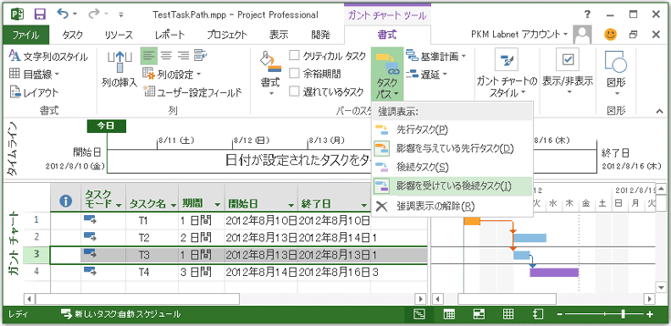

# Task.PathDrivenSuccessor プロパティ (プロジェクト)
タスクが **タスクのパス**] ボックスの一覧で、  **DrivenSuccessors**の項目が選択されている場合に、選択したタスクによって駆動されている後続タスクであるかどうかを示す値を取得します。読み取り専用 **Boolean**です。

## 構文

 _式_. **PathDrivenSuccessor**

 _式_ Task **Task** オブジェクトを表す変数を指定します。


## 注釈

 **Task.PathDrivenSuccessor**プロパティは、 **タスクのパス**」ドロップ ダウン リストで、[ **書式**] タブの [ **ガント チャート ツール**リボンの **[後続タスクの優先**項目に関連付けられます。タスクのパスは、Project クライアントで、[書式設定機能では主にガント チャートのタスクとタスクの現在の選択範囲、選択範囲に指定したタスクとの関係に依存する色があります。図 1 の **タスクのパス**] ボックスの一覧で **の推進の先行タスク**と **後続タスクの優先**項目が選択されます。 **T3**を選択すると、T1 は駆動の先行タスク、T4 は、被駆動の後続タスクをガント チャート] ビューを示しています。


**図 1 です。タスク パス プロパティを使用してタスクを強調表示するのには**

 **PathDrivenSuccessor**プロパティは、  **[後続タスクの優先**での選択ユーザー インターフェイスと同じように動作していません。代わりに、  **PathDrivenSuccessor**プロパティは、  **True**両方の次の条件に該当する場合: (a)、タスク駆動型、選択したタスクの後続タスクであり、(b)、  **[後続タスクの優先**項目が選択された **タスクのパス**にします。タスクを手動で選択または VBA を使用してタスクを選択し、VBA を使用して、別のタスクが選択されているタスクに後続タスクであるかどうかを確認できます。などの場合は、図 1 に示すように 3 番目のタスクを選択して、 **後続タスクの優先**項目が選択された **タスクのパス**で、次のステートメントは、VBE の **イミディ エイト**ウィンドウで **True**を印刷します。


```
? ActiveProject.Tasks(4).PathDrivenSuccessor
```

ただし、 **後続タスクの優先**項目が選択されていない場合、前のステートメントは **False**を印刷します。Projectには、 **タスクのパス**] ボックスの一覧で項目を設定することができる VBA メソッドはありません。


## 例

 **TestTaskPath**マクロは、プロジェクトでは、各タスクを選択し、他のタスクを選択したタスクに関連付ける方法を表示する順に 4 つのタスクのパス プロパティを使用します。


```
Option Explicit

Sub TestTaskPath()
    Dim t As Task
    Dim chkTsk As Task
    Dim selectedTaskId As Integer
    
    For Each t In ActiveProject.Tasks
        selectedTaskId = t.ID
        Application.SelectRow Row:=selectedTaskId, RowRelative:=False
            
        If Not (ActiveSelection.Tasks Is Nothing) Then
            Debug.Print
            
            With ActiveSelection.Tasks(1)
                Debug.Print "Selected task ID " &amp; .UniqueID &amp; ", name: " &amp; .Name
            End With
                        
            For Each chkTsk In ActiveProject.Tasks
                If Not (chkTsk.ID = selectedTaskId) Then
                    If chkTsk.PathPredecessor Then
                        Debug.Print vbTab &amp; chkTsk.Name &amp; ": PathPredecessor"
                    End If
                    If chkTsk.PathDrivingPredecessor Then
                        Debug.Print vbTab &amp; chkTsk.Name &amp; ": PathDrivingPredecessor"
                    End If
                    If chkTsk.PathSuccessor Then
                        Debug.Print vbTab &amp; chkTsk.Name &amp; ": PathSuccessor"
                    End If
                    If chkTsk.PathDrivenSuccessor Then
                        Debug.Print vbTab &amp; chkTsk.Name &amp; ": PathDrivenSuccessor"
                    End If
                End If
            Next chkTsk
        End If
    Next t
End Sub
```

図 1 プロジェクトの場合、 **先行タスク**、 **推進の先行タスク**、 **後続タスク**、および **後続タスクの優先**項目は、すべての選択した **タスクのパス**、  **TestTaskPath**マクロは、次の出力。


```
Selected task ID 1, name: T1
    T2: PathSuccessor
    T2: PathDrivenSuccessor
    T3: PathSuccessor
    T3: PathDrivenSuccessor
    T4: PathSuccessor
    T4: PathDrivenSuccessor

Selected task ID 2, name: T2
    T1: PathPredecessor
    T1: PathDrivingPredecessor

Selected task ID 3, name: T3
    T1: PathPredecessor
    T1: PathDrivingPredecessor
    T4: PathSuccessor
    T4: PathDrivenSuccessor

Selected task ID 4, name: T4
    T1: PathPredecessor
    T1: PathDrivingPredecessor
    T3: PathPredecessor
    T3: PathDrivingPredecessor
```


## プロパティ値

 **VARIANT**


## 関連項目


#### 概念


[タスク オブジェクト](bc6bb4a5-95a6-9d1f-3e28-92b9548a544a.md)
#### その他の技術情報


[PathDrivingPredecessor プロパティ](c78f744e-ed0d-8923-fb01-a0e40a14726f.md)
[PathPredecessor プロパティ](f0662677-cab5-10e2-e18c-fc291bfca28b.md)
[PathSuccessor プロパティ](827bf575-d93b-9959-c664-625c0e199699.md)